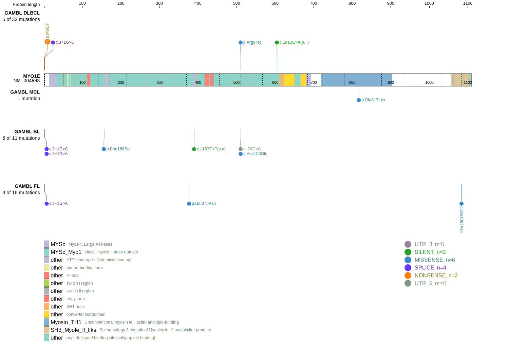
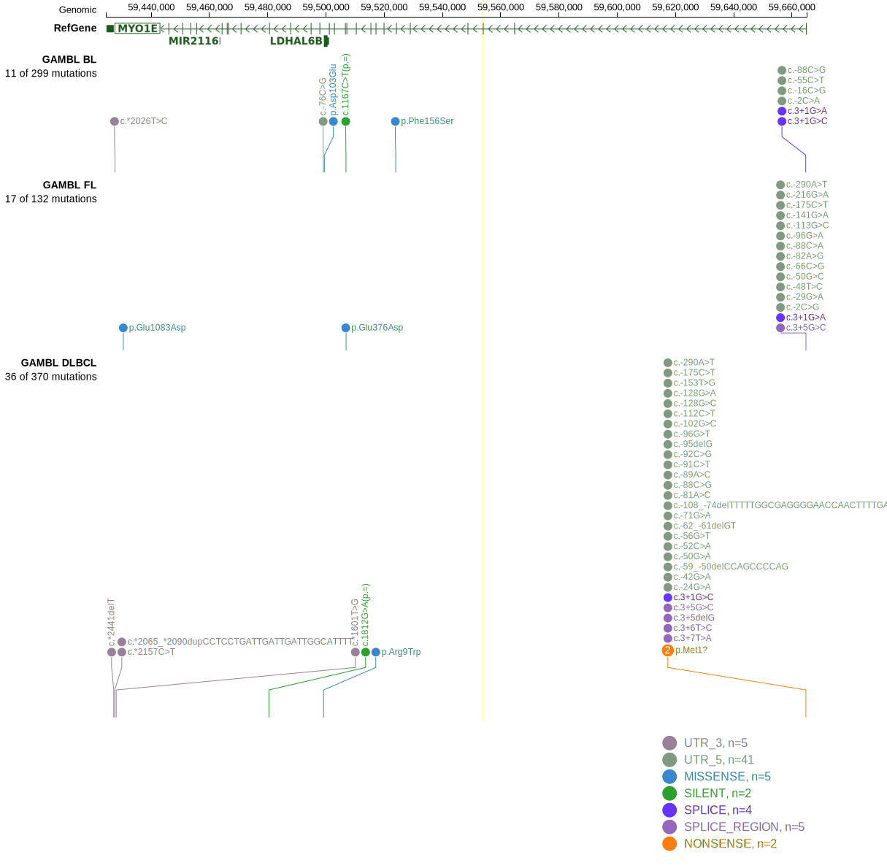

# MYO1E

## Relevance tier by entity

|Entity|Tier|Description                              |
|:------:|:----:|-----------------------------------------|
|BL    |2-a | aSHM target; Although recurrent, the relevance of mutations in BL is tenuous    |
|DLBCL |2-a | aSHM target; Although recurrent, the relevance of mutations in DLBCL is tenuous |

## Mutation incidence in large patient cohorts (GAMBL reanalysis)

|Entity|source               |frequency (%)|
|:------:|:---------------------:|:-------------:|
|BL    |GAMBL genomes+capture|2.08         |
|BL    |Thomas cohort        |1.30         |
|BL    |Panea cohort         |4.00         |
|DLBCL |GAMBL genomes        |2.49         |
|DLBCL |Schmitz cohort       |3.40         |
|DLBCL |Reddy cohort         |3.00         |
|DLBCL |Chapuy cohort        |1.28         |

## Mutation pattern and selective pressure estimates

|Entity|aSHM|Significant selection|dN/dS (missense)|dN/dS (nonsense)|
|:------:|:----:|:---------------------:|:----------------:|:----------------:|
|BL    |Yes |No                   |0.516           |12.845          |
|DLBCL |Yes |No                   |0.913           |14.181          |
|FL    |Yes |No                   |3.818           |29.467          |

## aSHM regions

|chr_name|hg19_start|hg19_end|region                                                                                    |regulatory_comment|
|:--------:|:----------:|:--------:|:------------------------------------------------------------------------------------------:|:------------------:|
|chr15   |59658991  |59671152|[TSS](https://genome.ucsc.edu/s/rdmorin/GAMBL%20hg19?position=chr15%3A59658991%2D59671152)|NA                |

View coding variants in ProteinPaint [hg19](https://morinlab.github.io/LLMPP/GAMBL/MYO1E_protein.html)  or [hg38](https://morinlab.github.io/LLMPP/GAMBL/MYO1E_protein_hg38.html)

View all variants in GenomePaint [hg19](https://morinlab.github.io/LLMPP/GAMBL/MYO1E.html)  or [hg38](https://morinlab.github.io/LLMPP/GAMBL/MYO1E_hg38.html)

