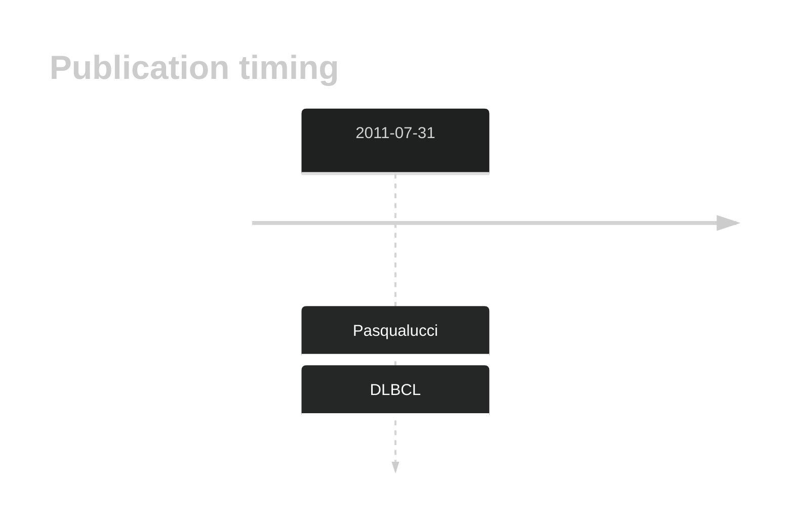
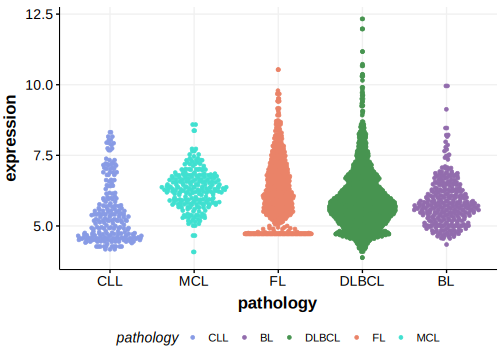

# MYOM2

## Overview
The prevalence of MYOM2 mutations in DLBCL varies across studies. The role of these mutations in lymphomagenesis has not been thoroughly explored. 
## History

## Relevance tier by entity

|Entity|Tier|Description               |
|:------:|:----:|--------------------------|
| |1   |high-confidence DLBCL gene|

## Mutation incidence in large patient cohorts (GAMBL reanalysis)

|Entity|source        |frequency (%)|
|:------:|:--------------:|:-------------:|
|DLBCL |GAMBL genomes |3.25         |
|DLBCL |Schmitz cohort|8.09         |
|DLBCL |Reddy cohort  |3.20         |
|DLBCL |Chapuy cohort |4.27         |

## Mutation pattern and selective pressure estimates

|Entity|aSHM|Significant selection|dN/dS (missense)|dN/dS (nonsense)|
|:------:|:----:|:---------------------:|:----------------:|:----------------:|
|BL    |No  |No                   |2.021           | 0.000          |
|DLBCL |No  |No                   |0.893           | 2.648          |
|FL    |No  |No                   |0.649           |12.057          |

View coding variants in ProteinPaint [hg19](https://morinlab.github.io/LLMPP/GAMBL/MYOM2_protein.html)  or [hg38](https://morinlab.github.io/LLMPP/GAMBL/MYOM2_protein_hg38.html)

View all variants in GenomePaint [hg19](https://morinlab.github.io/LLMPP/GAMBL/MYOM2.html)  or [hg38](https://morinlab.github.io/LLMPP/GAMBL/MYOM2_hg38.html)

## MYOM2 Expression

<!-- ORIGIN: pasqualucciAnalysisCodingGenome2011 -->
<!-- DLBCL: pasqualucciAnalysisCodingGenome2011 -->

## References
1.  Pasqualucci L, Trifonov V, Fabbri G, Ma J, Rossi D, Chiarenza A, Wells VA, Grunn A, Messina M, Elliot O, Chan J, Bhagat G, Chadburn A, Gaidano G, Mullighan CG, Rabadan R, Dalla-Favera R. Analysis of the coding genome of diffuse large B-cell lymphoma. Nat Genet. 2011 Jul 31;43(9):830–837. PMCID: PMC3297422
