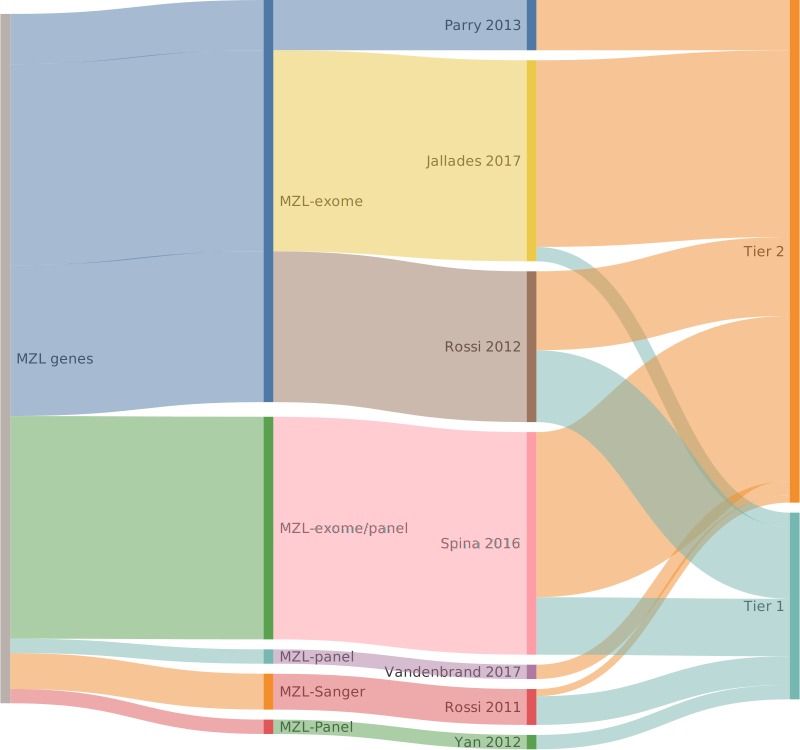

[[_TOC_]]

## MZL genes

## Tier 1, high-confidence MZL genes

[[include:pages/MZL_Tier1]]

## Tier 2, low-confidence MZL genes

[[include:pages/MZL_Tier2]]

|Gene|Summary| First MZL study | Other entities | QC result |
|:-:|:--:|:-:|:-|:-|
|[ABCA13](ABCA13)|Tier 2 GE[@spinaGeneticsNodalMarginal2016]|[Spina et al](papers/spinaGeneticsNodalMarginal2016)|[@sarkozyMutationalLandscapeGray2021]||
|[ACTG1](ACTG1)|Tier 2 GE[@spinaGeneticsNodalMarginal2016], aSHM|[Spina et al](papers/spinaGeneticsNodalMarginal2016)|[@deschGenotypingCirculatingTumor2020; @fanComprehensiveCharacterizationDriver2020; @hubschmannMutationalMechanismsShaping2021]||
|[ADD2](ADD2)|Tier 2 GE[@spinaGeneticsNodalMarginal2016]|[Spina et al](papers/spinaGeneticsNodalMarginal2016)|||
|[AMN](AMN)|Tier 2 GE[@spinaGeneticsNodalMarginal2016]|[Spina et al](papers/spinaGeneticsNodalMarginal2016)|||
|[AMOTL1](AMOTL1)|Tier 2 GE[@parryWholeExomeSequencing2013]|[Parry et al](papers/parryWholeExomeSequencing2013)|||
|[AOC2](AOC2)|Tier 2 GE[@spinaGeneticsNodalMarginal2016]|[Spina et al](papers/spinaGeneticsNodalMarginal2016)|||
|[ARHGAP20](ARHGAP20)|Tier 2 GE[@jalladesExomeSequencingIdentifies2017]|[Jallades et al](papers/jalladesExomeSequencingIdentifies2017)|||
|[ARHGEF15](ARHGEF15)|Tier 2 GE[@jalladesExomeSequencingIdentifies2017]|[Jallades et al](papers/jalladesExomeSequencingIdentifies2017)|||
|[ARHGEF17](ARHGEF17)|Tier 2 GE[@jalladesExomeSequencingIdentifies2017]|[Jallades et al](papers/jalladesExomeSequencingIdentifies2017)|||
|[BCOR](BCOR)|Tier 2 GE[@jalladesExomeSequencingIdentifies2017]|[Jallades et al](papers/jalladesExomeSequencingIdentifies2017)|[@nadeuGenomicEpigenomicInsights2020]||
|[C6orf103](C6orf103)|Tier 2 GE[@spinaGeneticsNodalMarginal2016]|[Spina et al](papers/spinaGeneticsNodalMarginal2016)|||
|[CBFA2T3](CBFA2T3)|Tier 2 GE[@parryWholeExomeSequencing2013]|[Parry et al](papers/parryWholeExomeSequencing2013)|||
|[CD79A](CD79A)|Tier 2 GE[@rossiCodingGenomeSplenic2012]|[Rossi et al](papers/rossiCodingGenomeSplenic2012)|[@burkhardtClinicalRelevanceMolecular2022]||
|[CD9B](CD9B)|Tier 2 GE[@vandenbrandRecurrentMutationsGenes2017]|[Vandenbrand et al](papers/vandenbrandRecurrentMutationsGenes2017)|||
|[CDC42BPB](CDC42BPB)|Tier 2 GE[@spinaGeneticsNodalMarginal2016]|[Spina et al](papers/spinaGeneticsNodalMarginal2016)|[@hubschmannMutationalMechanismsShaping2021]||
|[CDKN2A](CDKN2A)|Tier 2 GE[@spinaGeneticsNodalMarginal2016], FE[@kannengiesserFunctionalStructuralGenetic2009]|[Spina et al](papers/spinaGeneticsNodalMarginal2016)|[@grandeGenomewideDiscoverySomatic2019; @morinMutationalStructuralAnalysis2013]||
|[CLGN](CLGN)|Tier 2 GE[@spinaGeneticsNodalMarginal2016]|[Spina et al](papers/spinaGeneticsNodalMarginal2016)|||
|[CNBP](CNBP)|Tier 2 GE[@spinaGeneticsNodalMarginal2016]|[Spina et al](papers/spinaGeneticsNodalMarginal2016)|||
|[CNKSR2](CNKSR2)|Tier 2 GE[@spinaGeneticsNodalMarginal2016]|[Spina et al](papers/spinaGeneticsNodalMarginal2016)|||
|[CREBBP](CREBBP)|Tier 2 GE[@parryWholeExomeSequencing2013], FE[@pasqualucciInactivatingMutationsAcetyltransferase2011]|[Parry et al](papers/parryWholeExomeSequencing2013)|[@dunsCharacterizationDLBCLPMBL2021; @loveGeneticLandscapeMutations2012; @pasqualucciInactivatingMutationsAcetyltransferase2011]||
|[DNAH5](DNAH5)|Tier 2 GE[@jalladesExomeSequencingIdentifies2017]|[Jallades et al](papers/jalladesExomeSequencingIdentifies2017)|[@morinMutationalStructuralAnalysis2013]||
|[DNAH7](DNAH7)|Tier 2 GE[@jalladesExomeSequencingIdentifies2017]|[Jallades et al](papers/jalladesExomeSequencingIdentifies2017)|||
|[DNAI1](DNAI1)|Tier 2 GE[@jalladesExomeSequencingIdentifies2017]|[Jallades et al](papers/jalladesExomeSequencingIdentifies2017)|||
|[DOCK6](DOCK6)|Tier 2 GE[@jalladesExomeSequencingIdentifies2017]|[Jallades et al](papers/jalladesExomeSequencingIdentifies2017)|||
|[DSP](DSP)|Tier 2 GE||[@zhangGeneticHeterogeneityDiffuse2013]||
|[DTNB](DTNB)|Tier 2 GE||||
|[DTX3L](DTX3L)|Tier 2 GE[@jalladesExomeSequencingIdentifies2017]|[Jallades et al](papers/jalladesExomeSequencingIdentifies2017)|||
|[EGR1](EGR1)|Tier 2 GE[@rossiCodingGenomeSplenic2012]|[Rossi et al](papers/rossiCodingGenomeSplenic2012)|[@krysiakRecurrentSomaticMutations2017; @reichelFlowSortingExome2015]||
|[EGR2](EGR2)|Tier 2 GE[@rossiCodingGenomeSplenic2012]|[Rossi et al](papers/rossiCodingGenomeSplenic2012)|||
|[EZH1](EZH1)|Tier 2 GE[@jalladesExomeSequencingIdentifies2017]|[Jallades et al](papers/jalladesExomeSequencingIdentifies2017)|||
|[FAT4](FAT4)|Tier 2 GE[@parryWholeExomeSequencing2013]|[Parry et al](papers/parryWholeExomeSequencing2013)|[@morinMutationalStructuralAnalysis2013; @zhangGenomicLandscapeMantle2014]||
|[FBXO11](FBXO11)|Tier 2 GE[@parryWholeExomeSequencing2013], FE[@duanFBXO11TargetsBCL62011]|[Parry et al](papers/parryWholeExomeSequencing2013)|[@arthurGenomewideDiscoverySomatic2018; @richterRecurrentMutationID32012]||
|[GPR98](GPR98)|Tier 2 GE[@spinaGeneticsNodalMarginal2016]|[Spina et al](papers/spinaGeneticsNodalMarginal2016)|||
|[GPS2](GPS2)|Tier 2 GE[@rossiCodingGenomeSplenic2012]|[Rossi et al](papers/rossiCodingGenomeSplenic2012)|||
|[HIST1H1D](HIST1H1D)|Tier 2 GE[@jalladesExomeSequencingIdentifies2017], aSHM|[Jallades et al](papers/jalladesExomeSequencingIdentifies2017)|[@krysiakRecurrentSomaticMutations2017; @morinMutationalStructuralAnalysis2013]||
|[HIST1H2AD](HIST1H2AD)|Tier 2 GE[@jalladesExomeSequencingIdentifies2017]|[Jallades et al](papers/jalladesExomeSequencingIdentifies2017)|||
|[HIST1H2AG](HIST1H2AG)|Tier 2 GE[@rossiCodingGenomeSplenic2012]|[Rossi et al](papers/rossiCodingGenomeSplenic2012)|[@krysiakRecurrentSomaticMutations2017; @morinMutationalStructuralAnalysis2013; @paneaWholeGenomeLandscape2019]||
|[HIST1H2BK](HIST1H2BK)|Tier 2 GE[@rossiCodingGenomeSplenic2012], aSHM|[Rossi et al](papers/rossiCodingGenomeSplenic2012)|[@paneaWholeGenomeLandscape2019; @zhangGeneticHeterogeneityDiffuse2013]||
|[HIST4H4](HIST4H4)|Tier 2 GE[@jalladesExomeSequencingIdentifies2017]|[Jallades et al](papers/jalladesExomeSequencingIdentifies2017)|||
|[HRAS](HRAS)|Tier 2 GE[@jalladesExomeSequencingIdentifies2017]|[Jallades et al](papers/jalladesExomeSequencingIdentifies2017)|[@reddyGeneticFunctionalDrivers2017]||
|[IKBKB](IKBKB)|Tier 2 GE[@rossiAlterationBIRC3Multiple2011]|[Rossi et al](papers/rossiAlterationBIRC3Multiple2011)|[@reddyGeneticFunctionalDrivers2017; @wienandGenomicAnalysesFlowsorted2019]||
|[KAT6A](KAT6A)|Tier 2 GE[@jalladesExomeSequencingIdentifies2017]|[Jallades et al](papers/jalladesExomeSequencingIdentifies2017)|||
|[KDM6A](KDM6A)|Tier 2 GE[@jalladesExomeSequencingIdentifies2017]|[Jallades et al](papers/jalladesExomeSequencingIdentifies2017)|||
|[KIF26A](KIF26A)|Tier 2 GE[@jalladesExomeSequencingIdentifies2017]|[Jallades et al](papers/jalladesExomeSequencingIdentifies2017)|||
|[LRP1B](LRP1B)|Tier 2 GE[@spinaGeneticsNodalMarginal2016]|[Spina et al](papers/spinaGeneticsNodalMarginal2016)|[@zhangGeneticHeterogeneityDiffuse2013]||
|[MCRS1](MCRS1)|Tier 2 GE[@rossiCodingGenomeSplenic2012]|[Rossi et al](papers/rossiCodingGenomeSplenic2012)|||
|[MGA](MGA)|Tier 2 GE[@jalladesExomeSequencingIdentifies2017], FE[@depaoliMGASuppressorMYC2013]|[Jallades et al](papers/jalladesExomeSequencingIdentifies2017)|[@reddyGeneticFunctionalDrivers2017]||
|[MSL2](MSL2)|Tier 2 GE[@rossiCodingGenomeSplenic2012]|[Rossi et al](papers/rossiCodingGenomeSplenic2012)|||
|[MYC](MYC)|Tier 2 GE[@jalladesExomeSequencingIdentifies2017], FE[@freieGermlinePointMutation2024], aSHM|[Jallades et al](papers/jalladesExomeSequencingIdentifies2017)|[@dunsCharacterizationDLBCLPMBL2021; @johnstonCmycHypermutationBurkitt1992; @pasqualucciHypermutationMultipleProtooncogenes2001]||
|[MYLK](MYLK)|Tier 2 GE[@jalladesExomeSequencingIdentifies2017]|[Jallades et al](papers/jalladesExomeSequencingIdentifies2017)|||
|[NCOA6](NCOA6)|Tier 2 GE[@jalladesExomeSequencingIdentifies2017]|[Jallades et al](papers/jalladesExomeSequencingIdentifies2017)|||
|[NRAS](NRAS)|Tier 2 GE[@jalladesExomeSequencingIdentifies2017]|[Jallades et al](papers/jalladesExomeSequencingIdentifies2017)|||
|[PACRG](PACRG)|Tier 2 GE[@spinaGeneticsNodalMarginal2016]|[Spina et al](papers/spinaGeneticsNodalMarginal2016)|||
|[PARK2](PARK2)|Tier 2 GE[@spinaGeneticsNodalMarginal2016]|[Spina et al](papers/spinaGeneticsNodalMarginal2016)|||
|[PLA2G4D](PLA2G4D)|Tier 2 GE[@parryWholeExomeSequencing2013]|[Parry et al](papers/parryWholeExomeSequencing2013)|||
|[PLXNB3](PLXNB3)|Tier 2 GE[@spinaGeneticsNodalMarginal2016]|[Spina et al](papers/spinaGeneticsNodalMarginal2016)|[@zhangGenomicLandscapeMantle2014]||
|[RAF1](RAF1)|Tier 2 GE[@jalladesExomeSequencingIdentifies2017]|[Jallades et al](papers/jalladesExomeSequencingIdentifies2017)|[@fanComprehensiveCharacterizationDriver2020]||
|[RAPGEF2](RAPGEF2)|Tier 2 GE||[@zhangGeneticHeterogeneityDiffuse2013]||
|[RCOR1](RCOR1)|Tier 2 GE[@spinaGeneticsNodalMarginal2016]|[Spina et al](papers/spinaGeneticsNodalMarginal2016)|||
|[RFTN1](RFTN1)|Tier 2 GE, aSHM||[@arthurGenomewideDiscoverySomatic2018; @dunsCharacterizationDLBCLPMBL2021]||
|[ROCK1](ROCK1)|Tier 2 GE[@jalladesExomeSequencingIdentifies2017]|[Jallades et al](papers/jalladesExomeSequencingIdentifies2017)|||
|[RPL1L](RPL1L)|Tier 2 GE[@spinaGeneticsNodalMarginal2016]|[Spina et al](papers/spinaGeneticsNodalMarginal2016)|||
|[SAMD5](SAMD5)|Tier 2 GE[@spinaGeneticsNodalMarginal2016]|[Spina et al](papers/spinaGeneticsNodalMarginal2016)|||
|[SCG3](SCG3)|Tier 2 GE[@spinaGeneticsNodalMarginal2016]|[Spina et al](papers/spinaGeneticsNodalMarginal2016)|||
|[STXBP5](STXBP5)|Tier 2 GE[@spinaGeneticsNodalMarginal2016]|[Spina et al](papers/spinaGeneticsNodalMarginal2016)|||
|[SWAP70](SWAP70)|Tier 2 GE[@rossiCodingGenomeSplenic2012]|[Rossi et al](papers/rossiCodingGenomeSplenic2012)|||
|[TAF1](TAF1)|Tier 2 GE[@spinaGeneticsNodalMarginal2016]|[Spina et al](papers/spinaGeneticsNodalMarginal2016)|[@morinMutationalStructuralAnalysis2013]||
|[TBK1](TBK1)|Tier 2 GE[@jalladesExomeSequencingIdentifies2017]|[Jallades et al](papers/jalladesExomeSequencingIdentifies2017)|||
|[TCTN2](TCTN2)|Tier 2 GE[@spinaGeneticsNodalMarginal2016]|[Spina et al](papers/spinaGeneticsNodalMarginal2016)|||
|[TNIP2](TNIP2)|Tier 2 GE[@vandenbrandRecurrentMutationsGenes2017]|[Vandenbrand et al](papers/vandenbrandRecurrentMutationsGenes2017)|||
|[TRRAP](TRRAP)|Tier 2 GE[@rossiCodingGenomeSplenic2012]|[Rossi et al](papers/rossiCodingGenomeSplenic2012)|[@zhangGeneticHeterogeneityDiffuse2013]||
|[USH2A](USH2A)|Tier 2 GE[@parryWholeExomeSequencing2013]|[Parry et al](papers/parryWholeExomeSequencing2013)|||
|[WAC](WAC)|Tier 2 GE[@rossiCodingGenomeSplenic2012]|[Rossi et al](papers/rossiCodingGenomeSplenic2012)|[@reddyGeneticFunctionalDrivers2017]||
|[WNK1](WNK1)|Tier 2 GE[@jalladesExomeSequencingIdentifies2017]|[Jallades et al](papers/jalladesExomeSequencingIdentifies2017)|[@hubschmannMutationalMechanismsShaping2021; @thomasGeneticSubgroupsInform2023]||

## Tier 3, retired MZL genes

### *0 total*

|Gene|Summary| First MZL study | Other entities | QC result |
|:-:|:--:|:-:|:-|:-|

# References
