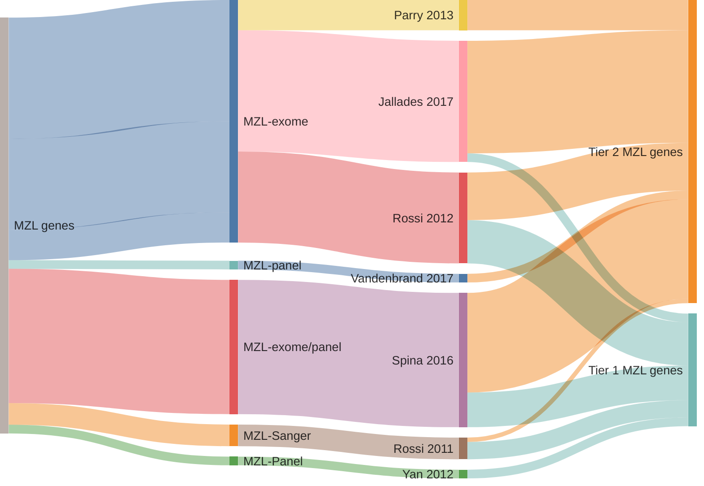

## Origins of MZL genes

## Tier 1 MZL genes

### *42 total*

|Gene|Tier| First MZL evidence | Other entities |
|:-:|:-:|:-|:-|
|[ACTB](ACTB)|1||[@lohrDiscoveryPrioritizationSomatic2012a; @wienandGenomicAnalysesFlowsorted2019b]|
|[ARID1A](ARID1A)|1|[@rossiCodingGenomeSplenic2012c]|[@krysiakRecurrentSomaticMutations2017b; @loveGeneticLandscapeMutations2012; @zhangGeneticHeterogeneityDiffuse2013; @wienandGenomicAnalysesFlowsorted2019b]|
|[ATM](ATM)|1|[@braggioGenomicAnalysisMarginal2012]|[@reddyGeneticFunctionalDrivers2017; @beaLandscapeSomaticMutations2013]|
|[BCL10](BCL10)|1|[@spinaGeneticsNodalMarginal2016b]|[@russler-germainMutationsAssociatedProgression2023b; @morinFrequentMutationHistonemodifying2011]|
|[BCL7A](BCL7A)|1||[@grandeGenomewideDiscoverySomatic2019; @krysiakRecurrentSomaticMutations2017b; @reichelFlowSortingExome2015a; @arthurGenomewideDiscoverySomatic2018]|
|[BIRC3](BIRC3)|1|[@rossiAlterationBIRC3Multiple2011a]|[@arthurGenomewideDiscoverySomatic2018; @beaLandscapeSomaticMutations2013; @dunsCharacterizationDLBCLPMBL2021b]|
|[BRAF](BRAF)|1||[@tiacciBRAFMutationsHairycell2011a; @loveGeneticLandscapeMutations2012]|
|[BTG1](BTG1)|1||[@sarkozyMutationalLandscapeGray2021a; @morinFrequentMutationHistonemodifying2011; @burkhardtClinicalRelevanceMolecular2022b]|
|[CARD11](CARD11)|1|[@yanBCRTLRSignaling2012a]|[@lenzOncogenicCARD11Mutations2008; @wuGeneticHeterogeneityPrimary2016; @morinFrequentMutationHistonemodifying2011; @paneaWholeGenomeLandscape2019]|
|[CCND3](CCND3)|1|[@jalladesExomeSequencingIdentifies2017]|[@deschGenotypingCirculatingTumor2020; @richterRecurrentMutationID32012a; @morinFrequentMutationHistonemodifying2011]|
|[CXCR4](CXCR4)|1||[@paneaWholeGenomeLandscape2019; @krysiakRecurrentSomaticMutations2017b; @khodabakhshiRecurrentTargetsAberrant2012]|
|[DTX1](DTX1)|1|[@rossiCodingGenomeSplenic2012c]|[@schmitzGeneticsPathogenesisDiffuse2018a; @gomezUltraDeepSequencingReveals2023; @paneaWholeGenomeLandscape2019]|
|[EP300](EP300)|1|[@rossiCodingGenomeSplenic2012c]|[@pasqualucciInactivatingMutationsAcetyltransferase2011a; @paneaWholeGenomeLandscape2019]|
|[EZH2](EZH2)|1||[@loveGeneticLandscapeMutations2012; @morinSomaticMutationsAltering2010a; @mottokIntegrativeGenomicAnalysis2019b]|
|[FAS](FAS)|1|[@spinaGeneticsNodalMarginal2016b]|[@schollMutationsRegionFAS2007]|
|[FAT1](FAT1)|1|[@spinaGeneticsNodalMarginal2016b]||
|[FOXO1](FOXO1)|1||[@dunsCharacterizationDLBCLPMBL2021b; @morinFrequentMutationHistonemodifying2011; @schmitzBurkittLymphomaPathogenesis2012]|
|[H1-4](H1-4)|1|||
|[H1-5](H1-5)|1|||
|[ID3](ID3)|1|[@spinaGeneticsNodalMarginal2016b]|[@richterRecurrentMutationID32012a; @schmitzBurkittLymphomaPathogenesis2012]|
|[KLF2](KLF2)|1|[@jalladesExomeSequencingIdentifies2017]|[@deschGenotypingCirculatingTumor2020; @pasqualucciAnalysisCodingGenome2011]|
|[KLHL6](KLHL6)|1|[@ganapathiGeneticLandscapeDural2016]|[@paneaWholeGenomeLandscape2019; @morinFrequentMutationHistonemodifying2011]|
|[KMT2D](KMT2D)|1|[@rossiCodingGenomeSplenic2012c]|[@deschGenotypingCirculatingTumor2020; @grandeGenomewideDiscoverySomatic2019; @beaLandscapeSomaticMutations2013; @morinFrequentMutationHistonemodifying2011]|
|[MAP3K14](MAP3K14)|1|[@rossiAlterationBIRC3Multiple2011a]|[@ottoGeneticLesionsTRAF32012a]|
|[MPEG1](MPEG1)|1||[@morinMutationalStructuralAnalysis2013]|
|[MYD88](MYD88)|1|[@yanBCRTLRSignaling2012a]|[@ngoOncogenicallyActiveMYD882011a]|
|[NCOR2](NCOR2)|1|[@spinaGeneticsNodalMarginal2016b]|[@schmitzBurkittLymphomaPathogenesis2012; @sarkozyMutationalLandscapeGray2021a]|
|[NOL9](NOL9)|1|[@spinaGeneticsNodalMarginal2016b]|[@schmitzGeneticsPathogenesisDiffuse2018a]|
|[NOTCH1](NOTCH1)|1|[@rossiCodingGenomeSplenic2012c]|[@loveGeneticLandscapeMutations2012; @beaLandscapeSomaticMutations2013; @pasqualucciAnalysisCodingGenome2011]|
|[NOTCH2](NOTCH2)|1|[@rossiCodingGenomeSplenic2012c]|[@paneaWholeGenomeLandscape2019; @beaLandscapeSomaticMutations2013; @troenNOTCH2MutationsMarginal2008]|
|[PCLO](PCLO)|1||[@lohrDiscoveryPrioritizationSomatic2012a]|
|[POU2AF1](POU2AF1)|1||[@krysiakRecurrentSomaticMutations2017b]|
|[PTPRD](PTPRD)|1|[@spinaGeneticsNodalMarginal2016b]||
|[SIN3A](SIN3A)|1|[@rossiCodingGenomeSplenic2012c]|[@grandeGenomewideDiscoverySomatic2019]|
|[SOCS1](SOCS1)|1||[@morinFrequentMutationHistonemodifying2011; @wenigerMutationsTumorSuppressor2006a]|
|[SPEN](SPEN)|1|[@rossiCodingGenomeSplenic2012c]|[@sarkozyMutationalLandscapeGray2021a]|
|[STAT6](STAT6)|1||[@yildizActivatingSTAT6Mutations2015c; @ritzRecurrentMutationsSTAT62009a]|
|[TBL1XR1](TBL1XR1)|1|[@rossiCodingGenomeSplenic2012c]|[@mareschalWholeExomeSequencing2016]|
|[TNFAIP3](TNFAIP3)|1|[@rossiAlterationBIRC3Multiple2011a]|[@compagnoMutationsMultipleGenes2009a; @schmitzTNFAIP3A20Tumor2009a]|
|[TNFRSF14](TNFRSF14)|1|[@spinaGeneticsNodalMarginal2016b]|[@morinFrequentMutationHistonemodifying2011; @cheungAcquiredTNFRSF14Mutations2010a]|
|[TP53](TP53)|1|[@rossiCodingGenomeSplenic2012c]|[@beaLandscapeSomaticMutations2013; @morinFrequentMutationHistonemodifying2011; @wildaInactivationARFMDM2p53Pathway2004; @tiacciPervasiveMutationsJAKSTAT2018b]|
|[TRAF3](TRAF3)|1|[@rossiAlterationBIRC3Multiple2011a]|[@ottoGeneticLesionsTRAF32012a; @pasqualucciAnalysisCodingGenome2011]|

## Tier 2 MZL genes

### *74 total*

|Gene|Tier| First MZL evidence | Other entities |
|:-:|:-:|:-|:-|
|[ABCA13](ABCA13)|2|[@spinaGeneticsNodalMarginal2016b]|[@sarkozyMutationalLandscapeGray2021a]|
|[ACTG1](ACTG1)|2|[@spinaGeneticsNodalMarginal2016b]|[@hubschmannMutationalMechanismsShaping2021b; @deschGenotypingCirculatingTumor2020]|
|[ADD2](ADD2)|2|[@spinaGeneticsNodalMarginal2016b]||
|[AMN](AMN)|2|[@spinaGeneticsNodalMarginal2016b]||
|[AMOTL1](AMOTL1)|2|[@parryWholeExomeSequencing2013]||
|[AOC2](AOC2)|2|[@spinaGeneticsNodalMarginal2016b]||
|[ARHGAP20](ARHGAP20)|2|[@jalladesExomeSequencingIdentifies2017]||
|[ARHGEF15](ARHGEF15)|2|[@jalladesExomeSequencingIdentifies2017]||
|[ARHGEF17](ARHGEF17)|2|[@jalladesExomeSequencingIdentifies2017]||
|[BCOR](BCOR)|2|[@jalladesExomeSequencingIdentifies2017]|[@nadeuGenomicEpigenomicInsights2020b]|
|[C6orf103](C6orf103)|2|[@spinaGeneticsNodalMarginal2016b]||
|[CBFA2T3](CBFA2T3)|2|[@parryWholeExomeSequencing2013]||
|[CD79A](CD79A)|2|[@rossiCodingGenomeSplenic2012c]|[@burkhardtClinicalRelevanceMolecular2022b]|
|[CD9B](CD9B)|2|[@vandenbrandRecurrentMutationsGenes2017]||
|[CDC42BPB](CDC42BPB)|2|[@spinaGeneticsNodalMarginal2016b]||
|[CDKN2A](CDKN2A)|2|[@spinaGeneticsNodalMarginal2016b]|[@grandeGenomewideDiscoverySomatic2019; @morinMutationalStructuralAnalysis2013]|
|[CLGN](CLGN)|2|[@spinaGeneticsNodalMarginal2016b]||
|[CNKSR2](CNKSR2)|2|[@spinaGeneticsNodalMarginal2016b]||
|[CREBBP](CREBBP)|2|[@parryWholeExomeSequencing2013]|[@loveGeneticLandscapeMutations2012; @dunsCharacterizationDLBCLPMBL2021b; @pasqualucciInactivatingMutationsAcetyltransferase2011a]|
|[DNAH5](DNAH5)|2|[@jalladesExomeSequencingIdentifies2017]|[@morinMutationalStructuralAnalysis2013]|
|[DNAH7](DNAH7)|2|[@jalladesExomeSequencingIdentifies2017]||
|[DNAI1](DNAI1)|2|[@jalladesExomeSequencingIdentifies2017]||
|[DOCK6](DOCK6)|2|[@jalladesExomeSequencingIdentifies2017]||
|[DSP](DSP)|2|||
|[DTNB](DTNB)|2|||
|[DTX3L](DTX3L)|2|[@jalladesExomeSequencingIdentifies2017]||
|[EGR1](EGR1)|2|[@rossiCodingGenomeSplenic2012c]|[@krysiakRecurrentSomaticMutations2017b; @reichelFlowSortingExome2015a]|
|[EGR2](EGR2)|2|[@rossiCodingGenomeSplenic2012c]||
|[EZH1](EZH1)|2|[@jalladesExomeSequencingIdentifies2017]||
|[FAT4](FAT4)|2|[@parryWholeExomeSequencing2013]|[@morinMutationalStructuralAnalysis2013; @zhangGenomicLandscapeMantle2014]|
|[FBXO11](FBXO11)|2|[@parryWholeExomeSequencing2013]|[@hubschmannMutationalMechanismsShaping2021b; @richterRecurrentMutationID32012a]|
|[GPR98](GPR98)|2|[@spinaGeneticsNodalMarginal2016b]||
|[GPS2](GPS2)|2|[@rossiCodingGenomeSplenic2012c]||
|[HIST1H1D](HIST1H1D)|2|[@jalladesExomeSequencingIdentifies2017]|[@krysiakRecurrentSomaticMutations2017b; @morinMutationalStructuralAnalysis2013]|
|[HIST1H2AD](HIST1H2AD)|2|[@jalladesExomeSequencingIdentifies2017]||
|[HIST1H2AG](HIST1H2AG)|2|[@rossiCodingGenomeSplenic2012c]|[@morinMutationalStructuralAnalysis2013; @krysiakRecurrentSomaticMutations2017b; @paneaWholeGenomeLandscape2019]|
|[HIST1H2BK](HIST1H2BK)|2|[@rossiCodingGenomeSplenic2012c]|[@paneaWholeGenomeLandscape2019]|
|[HIST4H4](HIST4H4)|2|[@jalladesExomeSequencingIdentifies2017]||
|[HRAS](HRAS)|2|[@jalladesExomeSequencingIdentifies2017]|[@reddyGeneticFunctionalDrivers2017]|
|[IKBKB](IKBKB)|2|[@rossiAlterationBIRC3Multiple2011a]|[@reddyGeneticFunctionalDrivers2017; @wienandGenomicAnalysesFlowsorted2019b]|
|[KAT6A](KAT6A)|2|[@jalladesExomeSequencingIdentifies2017]||
|[KDM6A](KDM6A)|2|[@jalladesExomeSequencingIdentifies2017]||
|[KIF26A](KIF26A)|2|[@jalladesExomeSequencingIdentifies2017]||
|[LRP1B](LRP1B)|2|[@spinaGeneticsNodalMarginal2016b]||
|[MCRS1](MCRS1)|2|[@rossiCodingGenomeSplenic2012c]||
|[MGA](MGA)|2|[@jalladesExomeSequencingIdentifies2017]|[@zhangGeneticHeterogeneityDiffuse2013]|
|[MSL2](MSL2)|2|[@rossiCodingGenomeSplenic2012c]||
|[MYC](MYC)|2|[@jalladesExomeSequencingIdentifies2017]|[@dunsCharacterizationDLBCLPMBL2021b; @pasqualucciHypermutationMultipleProtooncogenes2001a; @johnstonCmycHypermutationBurkitt1992]|
|[MYLK](MYLK)|2|[@jalladesExomeSequencingIdentifies2017]||
|[NCOA6](NCOA6)|2|[@jalladesExomeSequencingIdentifies2017]||
|[NRAS](NRAS)|2|[@jalladesExomeSequencingIdentifies2017]||
|[PACRG](PACRG)|2|[@spinaGeneticsNodalMarginal2016b]||
|[PARK2](PARK2)|2|[@spinaGeneticsNodalMarginal2016b]||
|[PLA2G4D](PLA2G4D)|2|[@parryWholeExomeSequencing2013]||
|[PLXNB3](PLXNB3)|2|[@spinaGeneticsNodalMarginal2016b]|[@zhangGenomicLandscapeMantle2014]|
|[RAF1](RAF1)|2|[@jalladesExomeSequencingIdentifies2017]||
|[RAPGEF2](RAPGEF2)|2|||
|[RCOR1](RCOR1)|2|[@spinaGeneticsNodalMarginal2016b]||
|[RFTN1](RFTN1)|2||[@arthurGenomewideDiscoverySomatic2018; @dunsCharacterizationDLBCLPMBL2021b]|
|[ROCK1](ROCK1)|2|[@jalladesExomeSequencingIdentifies2017]||
|[RPL1L](RPL1L)|2|[@spinaGeneticsNodalMarginal2016b]||
|[SAMD5](SAMD5)|2|[@spinaGeneticsNodalMarginal2016b]||
|[SCG3](SCG3)|2|[@spinaGeneticsNodalMarginal2016b]||
|[STXBP5](STXBP5)|2|[@spinaGeneticsNodalMarginal2016b]||
|[SWAP70](SWAP70)|2|[@rossiCodingGenomeSplenic2012c]||
|[TAF1](TAF1)|2|[@spinaGeneticsNodalMarginal2016b]|[@morinMutationalStructuralAnalysis2013]|
|[TBK1](TBK1)|2|[@jalladesExomeSequencingIdentifies2017]||
|[TCTN2](TCTN2)|2|[@spinaGeneticsNodalMarginal2016b]||
|[TNIP2](TNIP2)|2|[@vandenbrandRecurrentMutationsGenes2017]||
|[TRRAP](TRRAP)|2|[@rossiCodingGenomeSplenic2012c]|[@parryWholeExomeSequencing2013]|
|[USH2A](USH2A)|2|[@parryWholeExomeSequencing2013]||
|[WAC](WAC)|2|[@rossiCodingGenomeSplenic2012c]|[@reddyGeneticFunctionalDrivers2017]|
|[WNK1](WNK1)|2|[@jalladesExomeSequencingIdentifies2017]|[@thomasGeneticSubgroupsInform2023; @hubschmannMutationalMechanismsShaping2021b]|
|[ZNF9](ZNF9)|2|[@spinaGeneticsNodalMarginal2016b]||

# References
