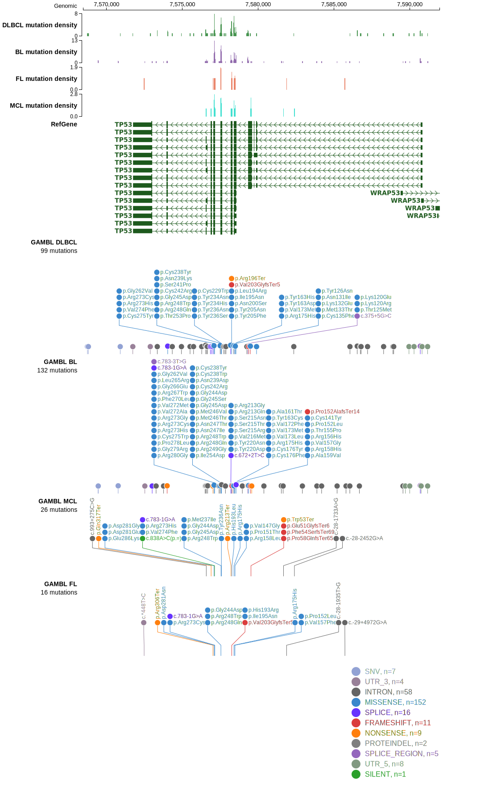

# [N2RF2]

## Mutation tier

|Entity|Tier|Description                              |
|:------:|:----:|-----------------------------------------|
|DLBCL |2   |relevance in DLBCL not firmly established|
## Mutation incidence

|Entity|source        |frequency (%)|
|:------:|:--------------:|:-------------:|
|DLBCL |GAMBL genomes |NA           |
|DLBCL |Schmitz cohort|NA           |
|DLBCL |Reddy cohort  |NA           |
|DLBCL |Chapuy cohort |NA           |

## Mutation pattern

|

> [!NOTE]
> First described in DLBCL in 2021 by [Hübschmann D](https://pubmed.ncbi.nlm.nih.gov/33953289)

View coding variants in ProteinPaint [hg19](https://www.bcgsc.ca/downloads/morinlab/GAMBL/test/genes/N2RF2_protein.html)  or [hg38](https://www.bcgsc.ca/downloads/morinlab/GAMBL/test/genes/N2RF2_protein_hg38.html)

View all variants in GenomePaint [hg19](https://www.bcgsc.ca/downloads/morinlab/GAMBL/test/genes/N2RF2.html)  or [hg38](https://www.bcgsc.ca/downloads/morinlab/GAMBL/test/genes/N2RF2_hg38.html)

