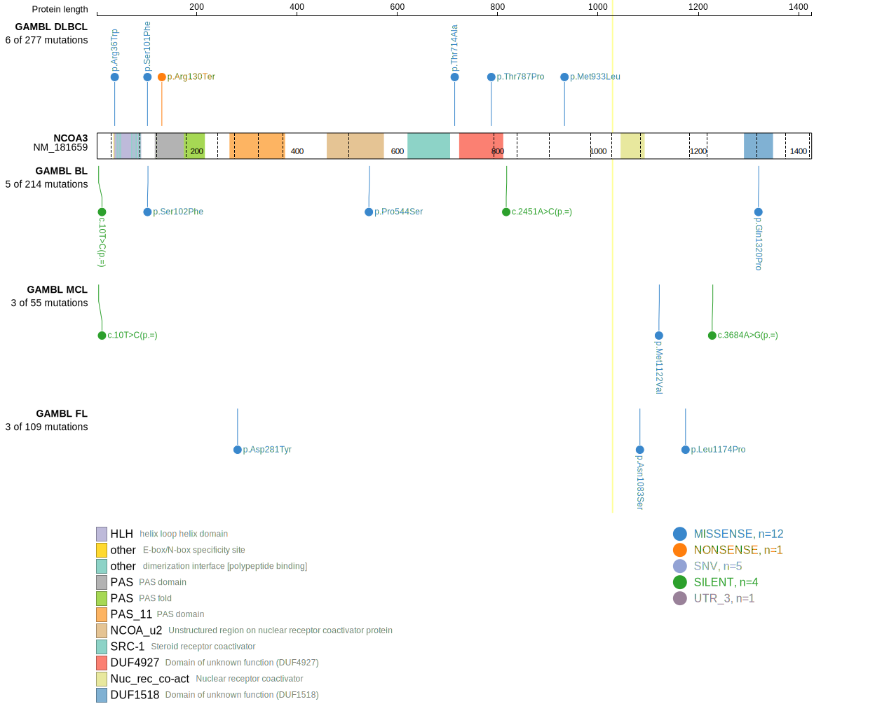
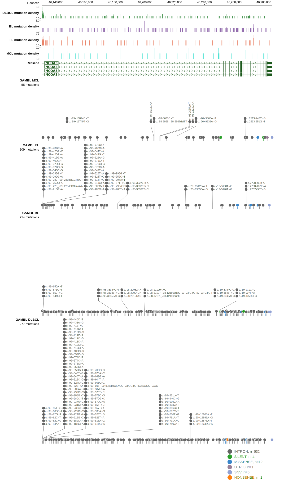
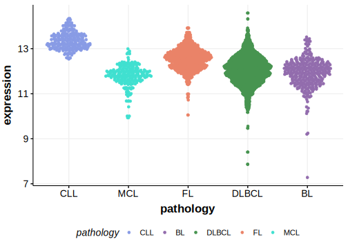

# NCOA3

## Relevance tier by entity

|Entity|Tier|Description                              |
|:------:|:----:|-----------------------------------------|
|DLBCL |2-a | aSHM target; Although recurrent, the relevance of mutations in DLBCL is tenuous |

## Mutation incidence in large patient cohorts (GAMBL reanalysis)

|Entity|source        |frequency (%)|
|:------:|:--------------:|:-------------:|
|DLBCL |GAMBL genomes |1.15         |
|DLBCL |Schmitz cohort|2.34         |
|DLBCL |Reddy cohort  |2.40         |
|DLBCL |Chapuy cohort |0.43         |

## Mutation pattern and selective pressure estimates

|Entity|aSHM|Significant selection|dN/dS (missense)|dN/dS (nonsense)|
|:------:|:----:|:---------------------:|:----------------:|:----------------:|
|BL    |Yes |No                   |1.087           |0.000           |
|DLBCL |Yes |No                   |0.000           |6.508           |
|FL    |Yes |No                   |5.600           |0.000           |

## aSHM regions

|chr_name|hg19_start|hg19_end|region                                                                                    |regulatory_comment|
|:--------:|:----------:|:--------:|:------------------------------------------------------------------------------------------:|:------------------:|
|chr20   |46128611  |46138099|[TSS](https://genome.ucsc.edu/s/rdmorin/GAMBL%20hg19?position=chr20%3A46128611%2D46138099)|active_promoter   |

View coding variants in ProteinPaint [hg19](https://morinlab.github.io/LLMPP/GAMBL/NCOA3_protein.html)  or [hg38](https://morinlab.github.io/LLMPP/GAMBL/NCOA3_protein_hg38.html)

View all variants in GenomePaint [hg19](https://morinlab.github.io/LLMPP/GAMBL/NCOA3.html)  or [hg38](https://morinlab.github.io/LLMPP/GAMBL/NCOA3_hg38.html)

## NCOA3 Expression

