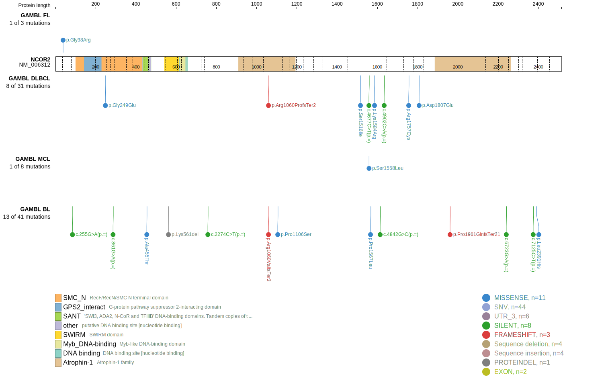
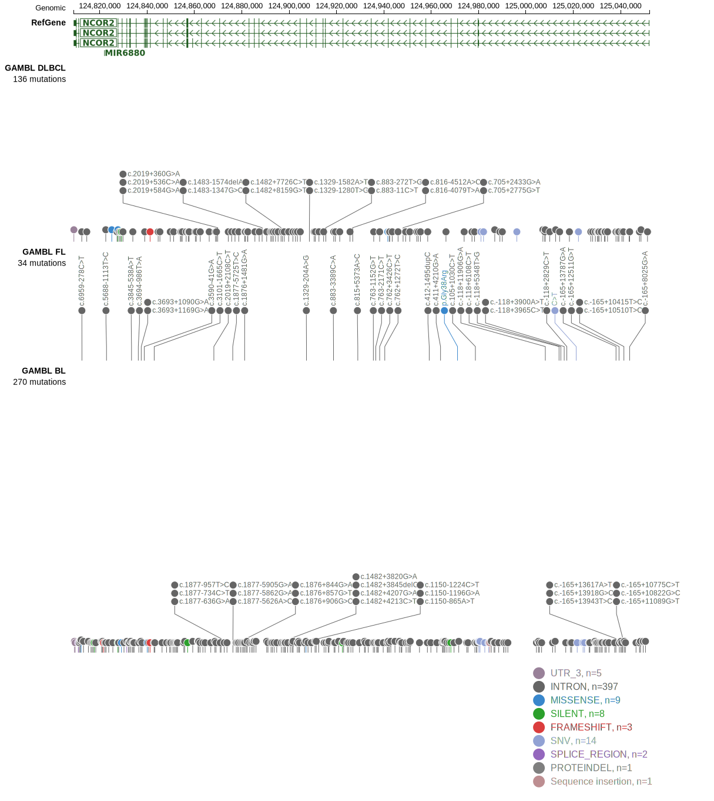
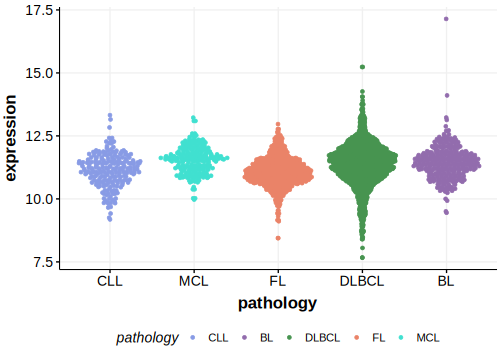

# NCOR2

## Relevance tier by entity

|Entity|Tier|Description                           |
|:------:|:----:|--------------------------------------|
|BL    |2   |relevance in BL not firmly established|
|DLBCL |1   |high-confidence DLBCL gene            |

## Mutation incidence in large patient cohorts (GAMBL reanalysis)

|Entity|source               |frequency (%)|
|:------:|:---------------------:|:-------------:|
|BL    |GAMBL genomes+capture|6.24         |
|BL    |Thomas cohort        |  NA         |
|BL    |Panea cohort         |  NA         |
|DLBCL |GAMBL genomes        |2.10         |
|DLBCL |Schmitz cohort       |5.74         |
|DLBCL |Reddy cohort         |3.60         |
|DLBCL |Chapuy cohort        |4.27         |

## Mutation pattern and selective pressure estimates

|Entity|aSHM|Significant selection|dN/dS (missense)|dN/dS (nonsense)|
|:------:|:----:|:---------------------:|:----------------:|:----------------:|
|BL    |No  |No                   |0.551           |0.000           |
|DLBCL |No  |No                   |1.376           |4.613           |
|FL    |No  |No                   |0.985           |0.000           |

> [!NOTE]
> First described in BL in 2022 by [Burkhardt B](https://pubmed.ncbi.nlm.nih.gov/35794096)

 ## NCOR2 Hotspots

| Chromosome |Coordinate (hg19) | ref>alt | HGVSp | 
 | :---:| :---: | :--: | :---: |

View coding variants in ProteinPaint [hg19](https://morinlab.github.io/LLMPP/GAMBL/NCOR2_protein.html)  or [hg38](https://morinlab.github.io/LLMPP/GAMBL/NCOR2_protein_hg38.html)

View all variants in GenomePaint [hg19](https://morinlab.github.io/LLMPP/GAMBL/NCOR2.html)  or [hg38](https://morinlab.github.io/LLMPP/GAMBL/NCOR2_hg38.html)

## NCOR2 Expression

