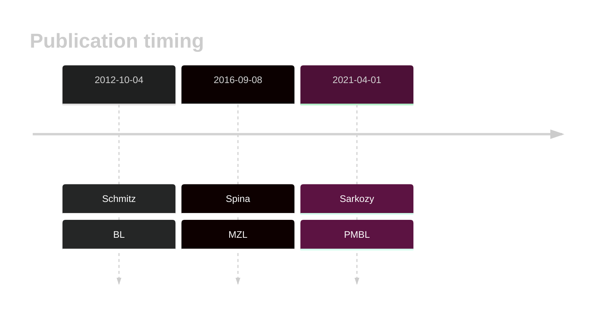

# NCOR2

## Overview
Mutations in this gene are relatively rare in DLBCL overall but show a pattern of inactivation. *Without further support, this gene may be migrated to Tier 2.*
## History

## Relevance tier by entity

|Entity|Tier|Description                           |
|:------:|:----:|--------------------------------------|
||2|relevance in PMBL/cHL/GZL not firmly established|
||1|high-confidence MZL gene|
|    |2   |relevance in BL not firmly established|
| |1   |high-confidence DLBCL gene            |

## Mutation incidence in large patient cohorts (GAMBL reanalysis)

|Entity|source               |frequency (%)|
|:------:|:---------------------:|:-------------:|
|BL    |GAMBL genomes+capture|6.24         |
|BL    |Thomas cohort        |  NA         |
|BL    |Panea cohort         |  NA         |
|DLBCL |GAMBL genomes        |2.10         |
|DLBCL |Schmitz cohort       |5.74         |
|DLBCL |Reddy cohort         |3.60         |
|DLBCL |Chapuy cohort        |4.27         |

## Mutation pattern and selective pressure estimates

|Entity|aSHM|Significant selection|dN/dS (missense)|dN/dS (nonsense)|
|:------:|:----:|:---------------------:|:----------------:|:----------------:|
|BL    |No  |No                   |0.551           |0.000           |
|DLBCL |No  |No                   |1.376           |4.613           |
|FL    |No  |No                   |0.985           |0.000           |

## NCOR2 Hotspots

| Chromosome |Coordinate (hg19) | ref>alt | HGVSp | 
 | :---:| :---: | :--: | :---: |

View coding variants in ProteinPaint [hg19](https://morinlab.github.io/LLMPP/GAMBL/NCOR2_protein.html)  or [hg38](https://morinlab.github.io/LLMPP/GAMBL/NCOR2_protein_hg38.html)

View all variants in GenomePaint [hg19](https://morinlab.github.io/LLMPP/GAMBL/NCOR2.html)  or [hg38](https://morinlab.github.io/LLMPP/GAMBL/NCOR2_hg38.html)

## NCOR2 Expression

<!-- FLAGGED FOR TIER 2 -->
<!-- ORIGIN: schmitzBurkittLymphomaPathogenesis2012 -->
<!-- MZL: spinaGeneticsNodalMarginal2016b -->
<!-- BL: schmitzBurkittLymphomaPathogenesis2012 -->
<!-- BL: schmitzBurkittLymphomaPathogenesis2012 -->

## References
1.  Schmitz R, Young RM, Ceribelli M, Jhavar S, Xiao W, Zhang M, Wright G, Shaffer AL, Hodson DJ, Buras E, Liu X, Powell J, Yang Y, Xu W, Zhao H, Kohlhammer H, Rosenwald A, Kluin P, Müller-Hermelink HK, Ott G, Gascoyne RD, Connors JM, Rimsza LM, Campo E, Jaffe ES, Delabie J, Smeland EB, Ogwang MD, Reynolds SJ, Fisher RI, Braziel RM, Tubbs RR, Cook JR, Weisenburger DD, Chan WC, Pittaluga S, Wilson W, Waldmann TA, Rowe M, Mbulaiteye SM, Rickinson AB, Staudt LM. Burkitt lymphoma pathogenesis and therapeutic targets from structural and functional genomics. Nature. 2012 Oct 4;490(7418):116–120. PMCID: PMC3609867
2.  Spina V, Khiabanian H, Messina M, Monti S, Cascione L, Bruscaggin A, Spaccarotella E, Holmes AB, Arcaini L, Lucioni M, Tabbò F, Zairis S, Diop F, Cerri M, Chiaretti S, Marasca R, Ponzoni M, Deaglio S, Ramponi A, Tiacci E, Pasqualucci L, Paulli M, Falini B, Inghirami G, Bertoni F, Foà R, Rabadan R, Gaidano G, Rossi D. The genetics of nodal marginal zone lymphoma. Blood. 2016 Sep 8;128(10):1362–1373. 
3.  Sarkozy C, Hung SS, Chavez EA, Duns G, Takata K, Chong LC, Aoki T, Jiang A, Miyata-Takata T, Telenius A, Slack GW, Molina TJ, Ben-Neriah S, Farinha P, Dartigues P, Damotte D, Mottok A, Salles GA, Casasnovas RO, Savage KJ, Laurent C, Scott DW, Traverse-Glehen A, Steidl C. Mutational landscape of gray zone lymphoma. Blood. 2021 Apr 1;137(13):1765–1776. PMID: 32961552
<!-- PMBL: sarkozyMutationalLandscapeGray2021a -->
