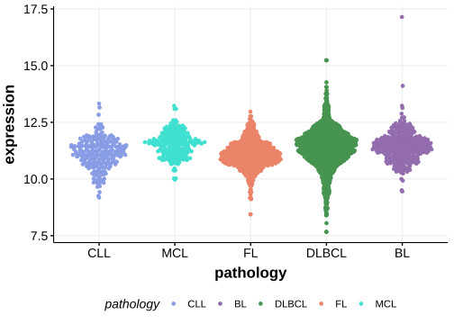

[[_TOC_]]

## Overview
Mutations in this gene are relatively rare in DLBCL overall but show a pattern of inactivation. 

## Relevance tier by entity

[[include:tables/table1_NCOR2.md]]

## Mutation incidence in large patient cohorts (GAMBL reanalysis)

### BL
[[include:tables/BL_NCOR2.md]]

## Mutation pattern and selective pressure estimates

[[include:tables/dnds_NCOR2.md]]

[[include:tables/browser_NCOR2.md]]

## Expression

<!-- FLAGGED FOR TIER 2 -->
<!-- ORIGIN: schmitzBurkittLymphomaPathogenesis2012 -->
<!-- MZL: spinaGeneticsNodalMarginal2016b -->
<!-- BL: schmitzBurkittLymphomaPathogenesis2012 -->
<!-- BL: schmitzBurkittLymphomaPathogenesis2012 -->

[[include:tables/mermaid_NCOR2.md]]

## References
<!-- PMBL: sarkozyMutationalLandscapeGray2021a -->
