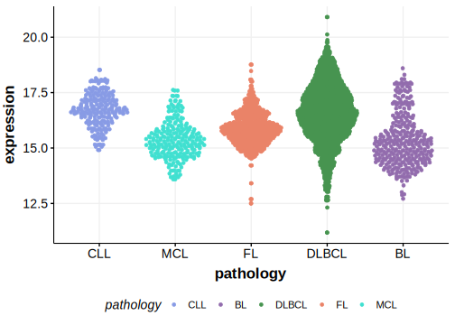

[[_TOC_]]

## Relevance tier by entity

[[include:tables/table1_NEAT1.md]]

## Mutation incidence in large patient cohorts (GAMBL reanalysis)

|Entity|source        |frequency (%)|
|:------:|:--------------:|:-------------:|
|DLBCL |GAMBL genomes |NA           |
|DLBCL |Schmitz cohort|NA           |
|DLBCL |Reddy cohort  |NA           |
|DLBCL |Chapuy cohort |NA           |

## Mutation pattern and selective pressure estimates

|

## aSHM regions

|chr_name|hg19_start|hg19_end|region                                                                                      |regulatory_comment|
|:--------:|:----------:|:--------:|:--------------------------------------------------------------------------------------------:|:------------------:|
|chr11   |65190369  |65192380|[ncRNA](https://genome.ucsc.edu/s/rdmorin/GAMBL%20hg19?position=chr11%3A65190369%2D65192380)|enhancer          |

[[include:tables/browser_NEAT1.md]]

## Expression

<!-- ORIGIN: arthurGenomewideDiscoverySomatic2018 -->
<!-- DLBCL: arthurGenomewideDiscoverySomatic2018 -->

[[include:tables/mermaid_NEAT1.md]]

## References

