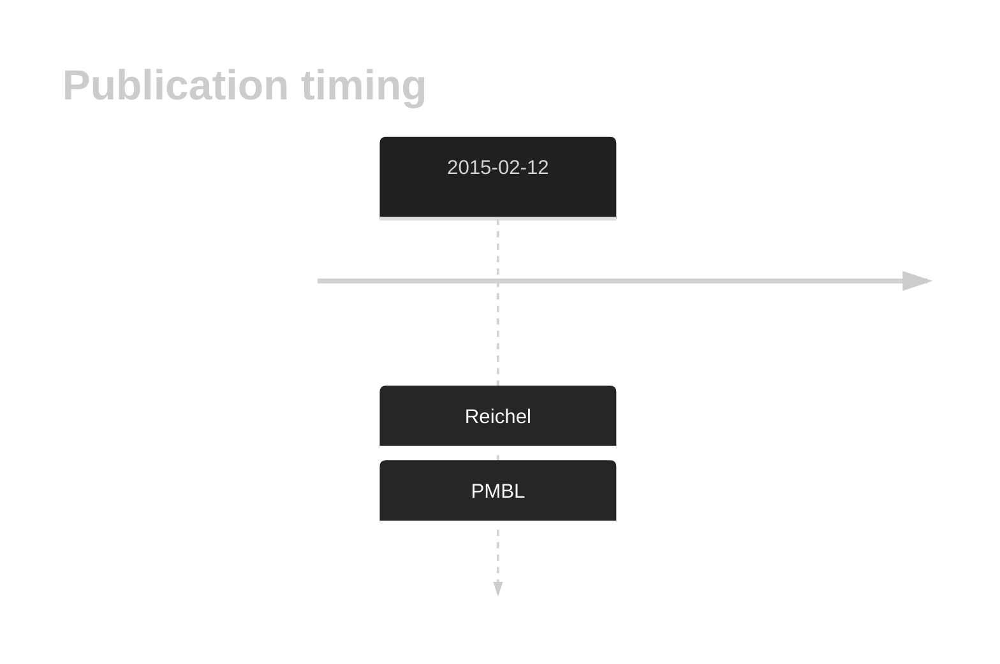

# NEK1

## History

## Relevance tier by entity

|Entity|Tier|Description|
|:------:|:----:|--------------------------------------|
||2|relevance in PMBL/cHL/GZL not firmly established[@reichelFlowSortingExome2015a]|

## Mutation incidence in large patient cohorts (GAMBL reanalysis)

|Entity|source |frequency (%)|
|:------:|:----:|:----:|
|BL|GAMBL Exome |5.172 |
|BL|GAMBL Genome |3.475 |
|DLBCL|GAMBL Exome |2.102 |
|DLBCL|GAMBL Genome |2.256 |
|FL|GAMBL Exome |0.573 |
|MCL|GAMBL Genome |1.754 |

## References

