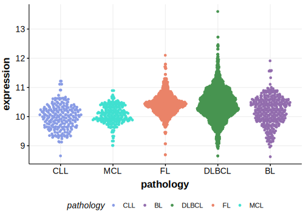

[[_TOC_]]

## Relevance tier by entity

[[include:table1_NF1.md]]

## Mutation incidence in large patient cohorts (GAMBL reanalysis)

|Entity|source        |frequency (%)|
|:------:|:--------------:|:-------------:|
|DLBCL |GAMBL genomes |2.87         |
|DLBCL |Schmitz cohort|4.04         |
|DLBCL |Reddy cohort  |2.50         |
|DLBCL |Chapuy cohort |2.14         |

## Mutation pattern and selective pressure estimates

[[include:dnds_NF1.md]]

[[include:browser_NF1.md]]

## Expression

<!-- ORIGIN: reddyGeneticFunctionalDrivers2017 -->
<!-- DLBCL: reddyGeneticFunctionalDrivers2017 -->

[[include:mermaid_NF1.md]]

## References

