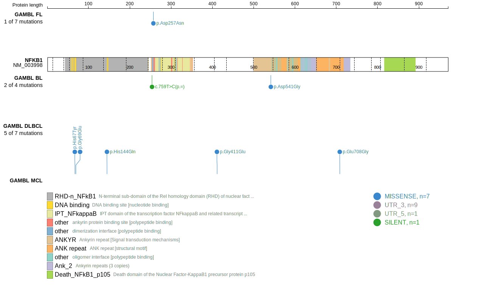

# NFKB1
## Overview
Mutations in this gene are relatively rare in DLBCL overall. Some hotspots have been identified in DLBCL. *Without further support, this gene may be migrated to Tier 2.*

## Relevance tier by entity

|Entity|Tier|Description               |
|:------:|:----:|--------------------------|
|DLBCL |1   |high-confidence DLBCL gene|

## Mutation incidence in large patient cohorts (GAMBL reanalysis)

|Entity|source        |frequency (%)|
|:------:|:--------------:|:-------------:|
|DLBCL |GAMBL genomes |2.10         |
|DLBCL |Schmitz cohort|1.28         |
|DLBCL |Reddy cohort  |1.60         |
|DLBCL |Chapuy cohort |3.42         |

## Mutation pattern and selective pressure estimates

|Entity|aSHM|Significant selection|dN/dS (missense)|dN/dS (nonsense)|
|:------:|:----:|:---------------------:|:----------------:|:----------------:|
|BL    |No  |No                   |0.644           |0               |
|DLBCL |No  |No                   |1.613           |0               |
|FL    |No  |No                   |4.561           |0               |

 ## NFKB1 Hotspots

| Chromosome |Coordinate (hg19) | ref>alt | HGVSp | 
 | :---:| :---: | :--: | :---: |
| chr4 | 103459054 | C>T | H67Y |
| chr4 | 103459061 | G>A | G69E |
| chr4 | 103501730 | G>A | D257N |

View coding variants in ProteinPaint [hg19](https://morinlab.github.io/LLMPP/GAMBL/NFKB1_protein.html)  or [hg38](https://morinlab.github.io/LLMPP/GAMBL/NFKB1_protein_hg38.html)

View all variants in GenomePaint [hg19](https://morinlab.github.io/LLMPP/GAMBL/NFKB1.html)  or [hg38](https://morinlab.github.io/LLMPP/GAMBL/NFKB1_hg38.html)

## NFKB1 Expression

