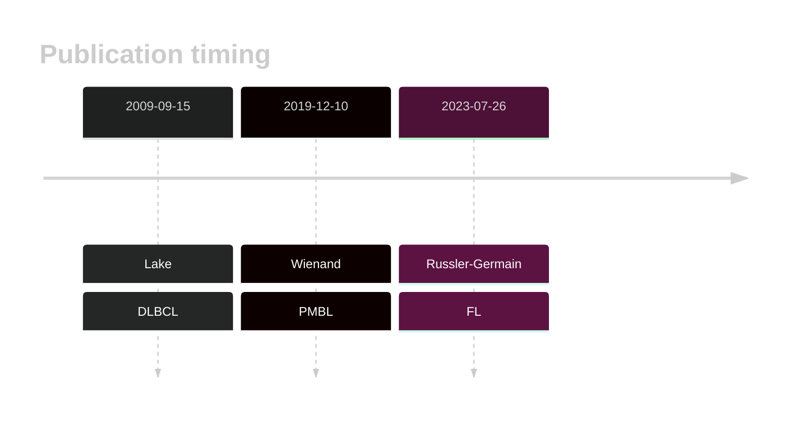
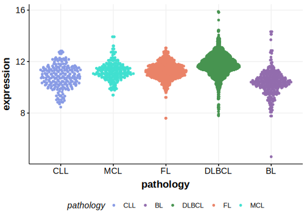

# NFKBIA
## Overview
NFKBIA encodes IκBα, an inhibitor of NF-κB, which regulates the NF-κB signaling pathway by preventing the translocation of NF-κB to the nucleus. Mutations in NFKBIA can disrupt this regulation, leading to constitutive activation of NF-κB signaling, which has an important role in a subset of DLBCLs. Mutations and deletions in NFKBIA are observed in DLBCL and are associated with constitutive activation of the NF-κB pathway. These mutations often occur in the ABC subtype and are associated with the **ST2** genetic subgroup of DLBCL.1
## History

## Relevance tier by entity

|Entity|Tier|Description                           |
|:------:|:----:|--------------------------------------|
||1|high-confidence PMBL/cHL/GZL gene|
| |1   |high-confidence DLBCL gene            |
|    |2   |relevance in FL not firmly established|

## Mutation incidence in large patient cohorts (GAMBL reanalysis)

|Entity|source               |frequency (%)|
|:------:|:---------------------:|:-------------:|
|DLBCL |GAMBL genomes        |4.40         |
|DLBCL |Schmitz cohort       |3.83         |
|DLBCL |Reddy cohort         |3.60         |
|DLBCL |Chapuy cohort        |4.70         |
|FL    |GAMBL genomes        |0.69         |

## Mutation pattern and selective pressure estimates

|Entity|aSHM|Significant selection|dN/dS (missense)|dN/dS (nonsense)|
|:------:|:----:|:---------------------:|:----------------:|:----------------:|
|BL    |No  |No                   |3.358           |17.442          |
|DLBCL |No  |Yes                  |9.385           |40.878          |
|FL    |No  |No                   |0.000           |28.519          |

> [!NOTE]
> First described in FL in 2023 by [Russler-Germain DA](https://pubmed.ncbi.nlm.nih.gov/37493986)

View coding variants in ProteinPaint [hg19](https://morinlab.github.io/LLMPP/GAMBL/NFKBIA_protein.html)  or [hg38](https://morinlab.github.io/LLMPP/GAMBL/NFKBIA_protein_hg38.html)

View all variants in GenomePaint [hg19](https://morinlab.github.io/LLMPP/GAMBL/NFKBIA.html)  or [hg38](https://morinlab.github.io/LLMPP/GAMBL/NFKBIA_hg38.html)

## NFKBIA Expression

<!-- ORIGIN: lakeMutationsNFKBIAEncoding2009 -->
<!-- DLBCL: lakeMutationsNFKBIAEncoding2009 -->
<!-- FL: russler-germainMutationsAssociatedProgression2023a -->
<!-- PMBL: wienandGenomicAnalysesFlowsorted2019b -->
## References
1. Wright GW, Huang DW, Phelan JD, Coulibaly ZA, Roulland S, Young RM, Wang JQ, Schmitz R, Morin RD, Tang J, Jiang A, Bagaev A, Plotnikova O, Kotlov N, Johnson CA, Wilson WH, Scott DW, Staudt LM. A Probabilistic Classification Tool for Genetic Subtypes of Diffuse Large B Cell Lymphoma with Therapeutic Implications. Cancer Cell. 2020 Apr 13;37(4):551-568.e14. doi: 10.1016/j.ccell.2020.03.015. PMID: 32289277; PMCID: PMC8459709.
2.  Lake A, Shield LA, Cordano P, Chui DTY, Osborne J, Crae S, Wilson KS, Tosi S, Knight SJL, Gesk S, Siebert R, Hay RT, Jarrett RF. Mutations of NFKBIA, encoding IkappaB alpha, are a recurrent finding in classical Hodgkin lymphoma but are not a unifying feature of non-EBV-associated cases. Int J Cancer. 2009 Sep 15;125(6):1334–1342. PMID: 19507254
3.  Wienand K, Chapuy B, Stewart C, Dunford AJ, Wu D, Kim J, Kamburov A, Wood TR, Cader FZ, Ducar MD, Thorner AR, Nag A, Heubeck AT, Buonopane MJ, Redd RA, Bojarczuk K, Lawton LN, Armand P, Rodig SJ, Fromm JR, Getz G, Shipp MA. Genomic analyses of flow-sorted Hodgkin Reed-Sternberg cells reveal complementary mechanisms of immune evasion. Blood Adv. 2019 Dec 10;3(23):4065–4080. PMCID: PMC6963251
4.  Russler-Germain DA, Krysiak K, Ramirez CA, Mosior M, Watkins MP, Gomez F, Skidmore ZL, Trani L, Gao F, Geyer S, Cashen A, Mehta-Shah N, Kahl B, Bartlett N, Alderuccio J, Lossos I, Ondrejka S, Hsi E, Martin P, Leonard J, Griffith M, Griffith O, Fehniger T. Mutations associated with progression in follicular lymphoma predict inferior outcomes at diagnosis: Alliance A151303. Blood Advances. 2023;7:5524–5539. 
