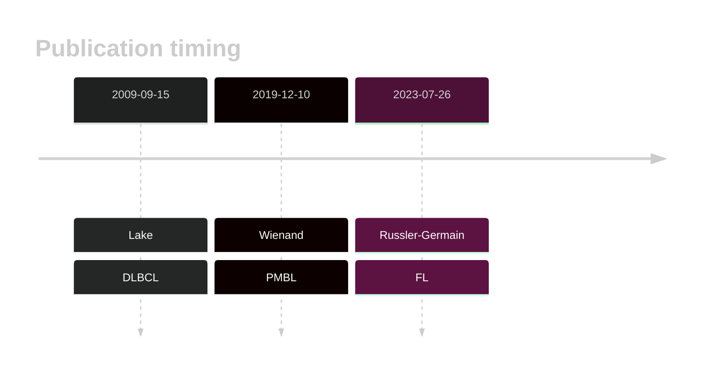

# NFKBIA

## Overview
NFKBIA encodes IκBα, an inhibitor of NF-κB, which regulates the NF-κB signaling pathway by preventing the translocation of NF-κB to the nucleus. Mutations in NFKBIA can disrupt this regulation, leading to constitutive activation of NF-κB signaling, which has an important role in a subset of DLBCLs. Mutations and deletions in NFKBIA are observed in DLBCL and are associated with constitutive activation of the NF-κB pathway. These mutations often occur in the ABC subtype and are associated with the **ST2** genetic subgroup of DLBCL.1

## History

## Relevance tier by entity

|Entity|Tier|Description                           |
|:------:|:----:|--------------------------------------|
||1|high-confidence PMBL/cHL/GZL gene[@wienandGenomicAnalysesFlowsorted2019]|
| |1   |high-confidence DLBCL gene            [@lakeMutationsNFKBIAEncoding2009]|
|    |2   |relevance in FL not firmly established[@russler-germainMutationsAssociatedProgression2023]|

## Mutation incidence in large patient cohorts (GAMBL reanalysis)

|Entity|source               |frequency (%)|
|:------:|:---------------------:|:-------------:|
|DLBCL |GAMBL genomes        |4.40         |
|DLBCL |Schmitz cohort       |3.83         |
|DLBCL |Reddy cohort         |3.60         |
|DLBCL |Chapuy cohort        |4.70         |
|FL    |GAMBL genomes        |0.69         |

## Mutation pattern and selective pressure estimates

|Entity|aSHM|Significant selection|dN/dS (missense)|dN/dS (nonsense)|
|:------:|:----:|:---------------------:|:----------------:|:----------------:|
|BL    |No  |No                   |3.358           |17.442          |
|DLBCL |No  |Yes                  |9.385           |40.878          |
|FL    |No  |No                   |0.000           |28.519          |

View coding variants in ProteinPaint [hg19](https://morinlab.github.io/LLMPP/GAMBL/NFKBIA_protein.html)  or [hg38](https://morinlab.github.io/LLMPP/GAMBL/NFKBIA_protein_hg38.html)

View all variants in GenomePaint [hg19](https://morinlab.github.io/LLMPP/GAMBL/NFKBIA.html)  or [hg38](https://morinlab.github.io/LLMPP/GAMBL/NFKBIA_hg38.html)

## NFKBIA Expression

<!-- ORIGIN: lakeMutationsNFKBIAEncoding2009 -->
<!-- DLBCL: lakeMutationsNFKBIAEncoding2009 -->
<!-- FL: russler-germainMutationsAssociatedProgression2023b -->
<!-- PMBL: wienandGenomicAnalysesFlowsorted2019b -->

## References
