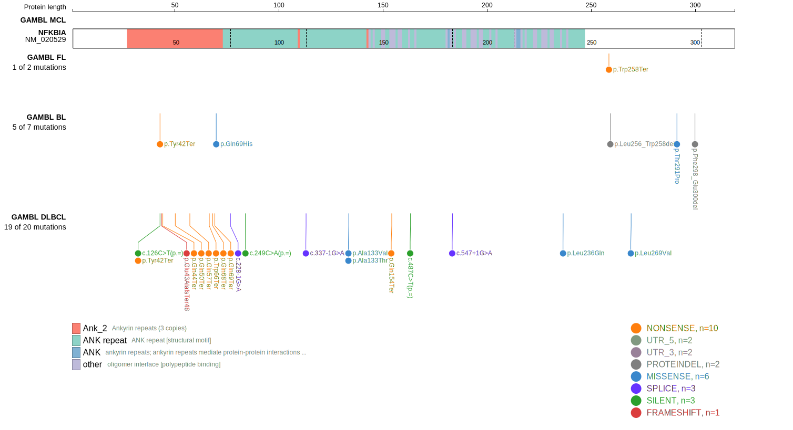
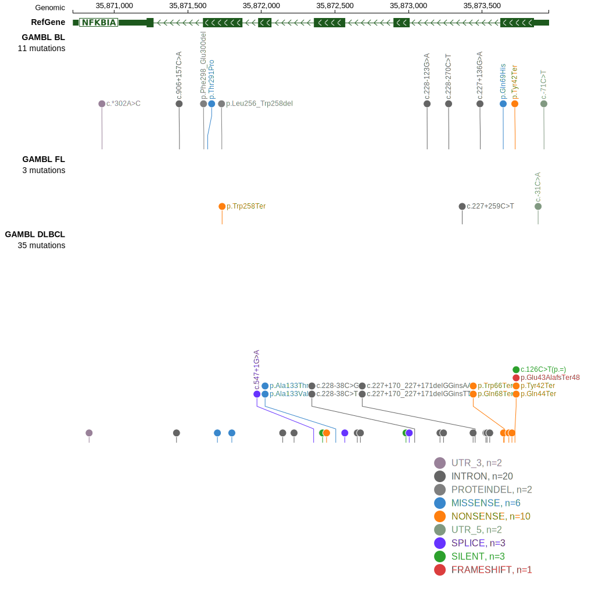

# [NFKBIA]

## Mutation tier

|Entity|Tier|Description                           |
|:------:|:----:|--------------------------------------|
|BL    |2   |relevance in BL not firmly established|
|DLBCL |1   |high-confidence DLBCL gene            |
|FL    |2   |relevance in FL not firmly established|
## Mutation incidence

|Entity|source               |frequency (%)|
|:------:|:---------------------:|:-------------:|
|BL    |GAMBL genomes+capture|1.39         |
|BL    |Thomas cohort        |1.70         |
|BL    |Panea cohort         |2.00         |
|DLBCL |GAMBL genomes        |4.40         |
|DLBCL |Schmitz cohort       |3.80         |
|DLBCL |Reddy cohort         |3.60         |
|DLBCL |Chapuy cohort        |4.70         |
|FL    |GAMBL genomes        |0.69         |

## Mutation pattern

|Entity|aSHM|Significant selection|dN/dS (missense)|dN/dS (nonsense)|
|:------:|:----:|:---------------------:|:----------------:|:----------------:|
|BL    |No  |No                   |3.358           |17.442          |
|DLBCL |No  |Yes                  |9.385           |40.878          |
|FL    |No  |No                   |0.000           |28.519          |

View coding variants in ProteinPaint [hg19](https://www.bcgsc.ca/downloads/morinlab/GAMBL/test/genes/NFKBIA_protein.html)  or [hg38](https://www.bcgsc.ca/downloads/morinlab/GAMBL/test/genes/NFKBIA_protein_hg38.html)

View all variants in GenomePaint [hg19](https://www.bcgsc.ca/downloads/morinlab/GAMBL/test/genes/NFKBIA.html)  or [hg38](https://www.bcgsc.ca/downloads/morinlab/GAMBL/test/genes/NFKBIA_hg38.html)

