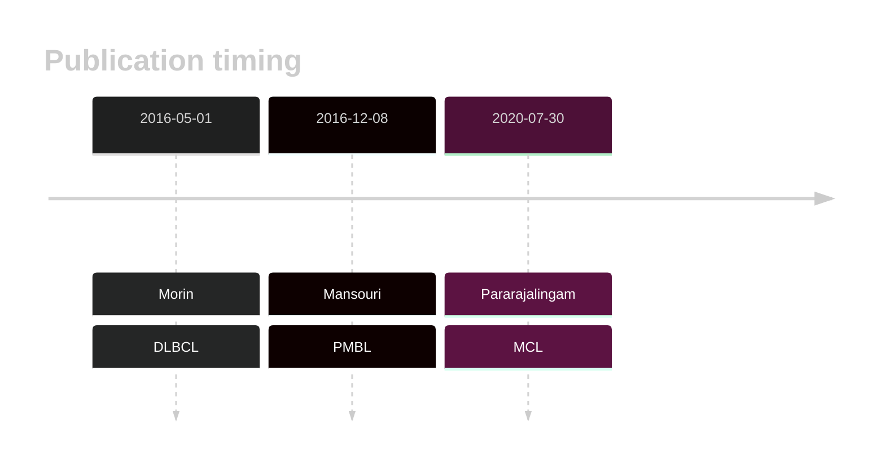
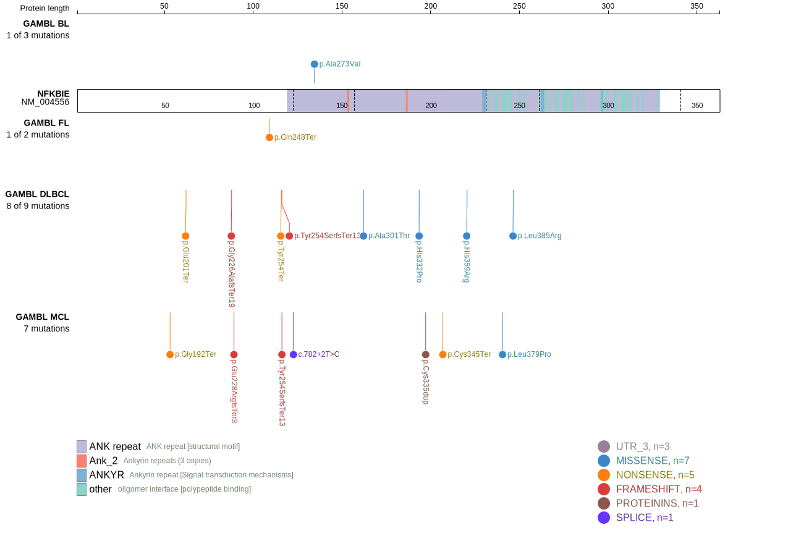
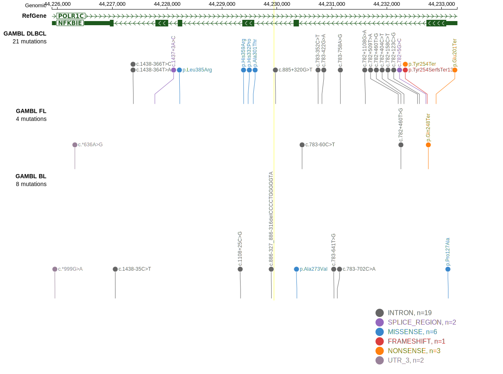
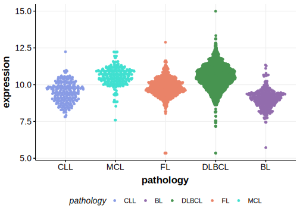

# NFKBIE

## Overview
NFKBIE encodes IκBε, a negative regulator of NF-κB. Mutations in NFKBIE can disrupt this regulatory function, leading to constitutive activation of NF-κB signaling.1 Mutations are relatively common in DLBCL and MCL.2 

## History

## Relevance tier by entity

|Entity|Tier|Description               |
|:------:|:----:|--------------------------|
||1|high-confidence PMBL/cHL/GZL gene[@mansouriFrequentNFKBIEDeletions2016]|
| |1   |high-confidence DLBCL gene[@morinGeneticLandscapesRelapsed2016]|
|   |1   |high-confidence MCL gene  [@pararajalingamCodingNoncodingDrivers2020]|

## Mutation incidence in large patient cohorts (GAMBL reanalysis)

[[include:DLBCL_NFKBIE.md]]

## Mutation pattern and selective pressure estimates

[[include:dnds_NFKBIE.md]]

View coding variants in ProteinPaint [hg19](https://morinlab.github.io/LLMPP/GAMBL/NFKBIE_protein.html)  or [hg38](https://morinlab.github.io/LLMPP/GAMBL/NFKBIE_protein_hg38.html)

View all variants in GenomePaint [hg19](https://morinlab.github.io/LLMPP/GAMBL/NFKBIE.html)  or [hg38](https://morinlab.github.io/LLMPP/GAMBL/NFKBIE_hg38.html)

## NFKBIE Expression

## References
<!-- ORIGIN: morinGeneticLandscapesRelapsed2016 -->
<!-- DLBCL: morinGeneticLandscapesRelapsed2016 -->
<!-- MCL: pararajalingamCodingNoncodingDrivers2020 -->
<!-- PMBL: mansouriFrequentNFKBIEDeletions2016 -->
