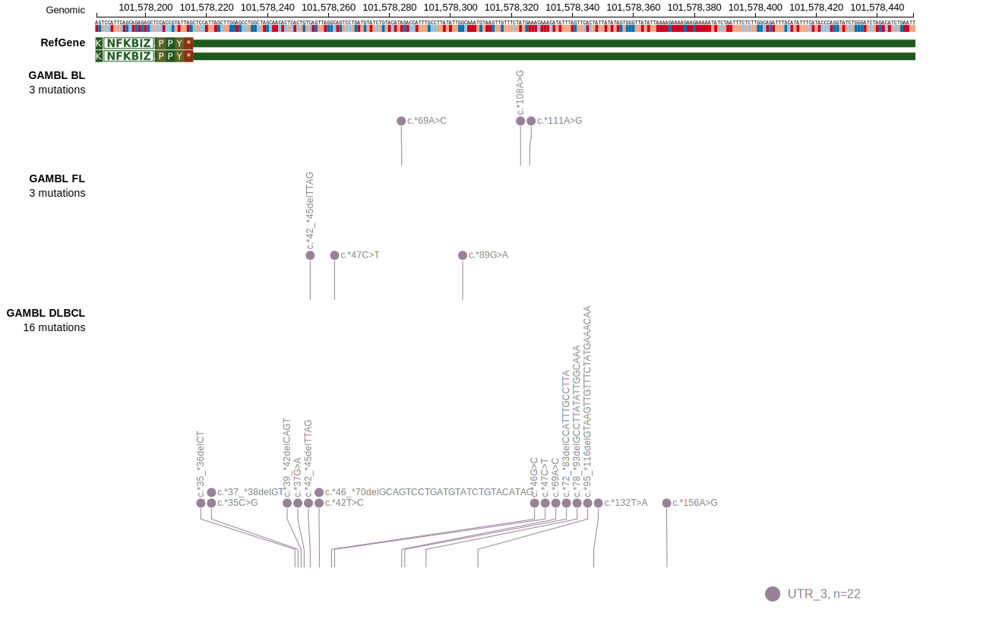
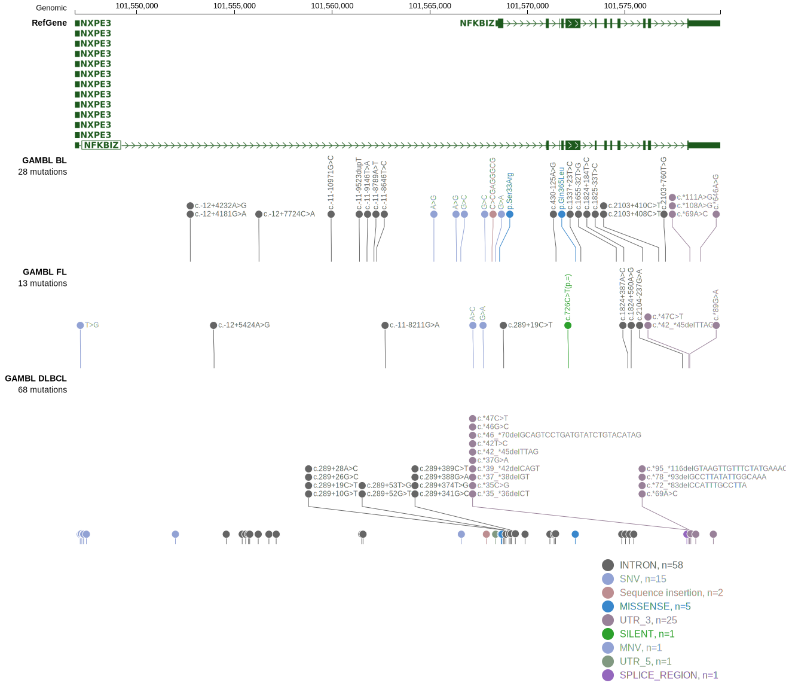
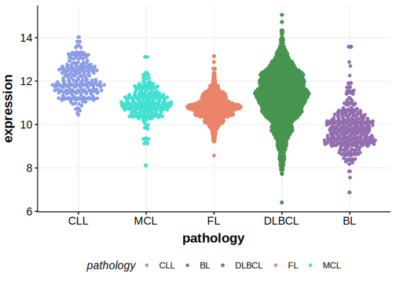

# NFKBIZ
## Overview
NFKBIZ is one of [a number of genes](https://github.com/morinlab/LLMPP/wiki/ashm) affected by aberrant somatic hypermutation in B-cell lymphomas, which complicates the interpretation of mutations at this locus. The predominant cluster of mutations in NFKBIZ is in the 3' UTR and not a consequence of aSHM.1 

## Relevance tier by entity

|Entity|Tier|Description               |
|:------:|:----:|--------------------------|
|DLBCL |1-a | aSHM target and high-confidence DLBCL gene|

## Mutation incidence in large patient cohorts (GAMBL reanalysis)

|Entity|source        |frequency (%)|
|:------:|:--------------:|:-------------:|
|DLBCL |GAMBL genomes |1.53         |
|DLBCL |Schmitz cohort|1.28         |
|DLBCL |Reddy cohort  |1.50         |
|DLBCL |Chapuy cohort |0.85         |

## Mutation pattern and selective pressure estimates

|Entity|aSHM|Significant selection|dN/dS (missense)|dN/dS (nonsense)|
|:------:|:----:|:---------------------:|:----------------:|:----------------:|
|BL    |Yes |No                   |3.346           |0               |
|DLBCL |Yes |No                   |2.091           |0               |
|FL    |Yes |No                   |0.000           |0               |

## aSHM regions

|chr_name|hg19_start|hg19_end |region                                                                                       |regulatory_comment|
|:--------:|:----------:|:---------:|:---------------------------------------------------------------------------------------------:|:------------------:|
|chr3    |101546669 |101547704|[TSS-1](https://genome.ucsc.edu/s/rdmorin/GAMBL%20hg19?position=chr3%3A101546669%2D101547704)|active_promoter   |
|chr3    |101568239 |101569274|[TSS-2](https://genome.ucsc.edu/s/rdmorin/GAMBL%20hg19?position=chr3%3A101568239%2D101569274)|active_promoter   |

View coding variants in ProteinPaint [hg19](https://morinlab.github.io/LLMPP/GAMBL/NFKBIZ_protein.html)  or [hg38](https://morinlab.github.io/LLMPP/GAMBL/NFKBIZ_protein_hg38.html)

View all variants in GenomePaint [hg19](https://morinlab.github.io/LLMPP/GAMBL/NFKBIZ.html)  or [hg38](https://morinlab.github.io/LLMPP/GAMBL/NFKBIZ_hg38.html)

## NFKBIZ Expression

## References
1. *Arthur SE, Jiang A, Grande BM, Alcaide M, Cojocaru R, Rushton CK, Mottok A, Hilton LK, Lat PK, Zhao EY, Culibrk L, Ennishi D, Jessa S, Chong L, Thomas N, Pararajalingam P, Meissner B, Boyle M, Davidson J, Bushell KR, Lai D, Farinha P, Slack GW, Morin GB, Shah S, Sen D, Jones SJM, Mungall AJ, Gascoyne RD, Audas TE, Unrau P, Marra MA, Connors JM, Steidl C, Scott DW, Morin RD. Genome-wide discovery of somatic regulatory variants in diffuse large B-cell lymphoma. Nat Commun. 2018 Oct 1;9(1):4001. doi: 10.1038/s41467-018-06354-3. PMID: 30275490; PMCID: PMC6167379.*
