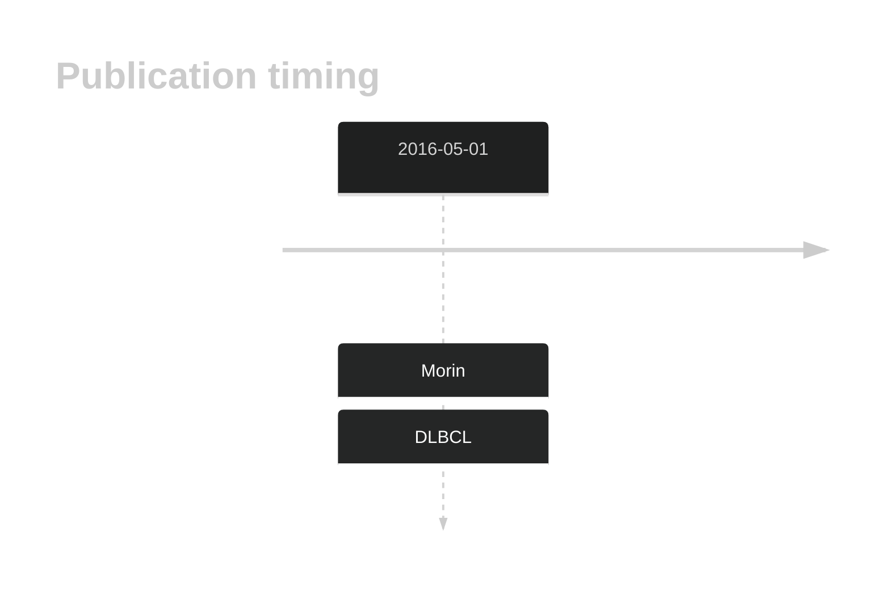

# NFKBIZ

## Overview
The NFKBIZ gene is a significant player in NF-κB signaling, with mutations leading to its deregulation. This pathway is critical in the pathogenesis of ABC DLBCL. NFKBIZ is one of [a number of genes](https://github.com/morinlab/LLMPP/wiki/ashm) affected by aberrant somatic hypermutation in B-cell lymphomas, which complicates the interpretation of mutations at this locus. The predominant cluster of mutations in NFKBIZ is in the 3' UTR and not a consequence of aSHM. NFKBIZ 3' UTR mutations confer a selective growth advantage in DLBCL cells by stabilizing NFKBIZ mRNA, resulting in increased protein levels.[@arthurGenomewideDiscoverySomatic2018] 

## History

## Relevance tier by entity

|Entity|Tier|Description               |
|:------:|:----:|--------------------------|
| |1-a | aSHM target and high-confidence DLBCL gene[@morinGeneticLandscapesRelapsed2016]|

## Mutation incidence in large patient cohorts (GAMBL reanalysis)

[[include:DLBCL_NFKBIZ.md]]

## Mutation pattern and selective pressure estimates

|Entity|aSHM|Significant selection|dN/dS (missense)|dN/dS (nonsense)|
|:------:|:----:|:---------------------:|:----------------:|:----------------:|
|BL    |Yes |No                   |3.346           |0               |
|DLBCL |Yes |No                   |2.091           |0               |
|FL    |Yes |No                   |0.000           |0               |

## aSHM regions

|chr_name|hg19_start|hg19_end |region                                                                                       |regulatory_comment|
|:--------:|:----------:|:---------:|:---------------------------------------------------------------------------------------------:|:------------------:|
|chr3    |101546669 |101547704|[TSS-1](https://genome.ucsc.edu/s/rdmorin/GAMBL%20hg19?position=chr3%3A101546669%2D101547704)|active_promoter   |
|chr3    |101568239 |101569274|[TSS-2](https://genome.ucsc.edu/s/rdmorin/GAMBL%20hg19?position=chr3%3A101568239%2D101569274)|active_promoter   |

View coding variants in ProteinPaint [hg19](https://morinlab.github.io/LLMPP/GAMBL/NFKBIZ_protein.html)  or [hg38](https://morinlab.github.io/LLMPP/GAMBL/NFKBIZ_protein_hg38.html)

View all variants in GenomePaint [hg19](https://morinlab.github.io/LLMPP/GAMBL/NFKBIZ.html)  or [hg38](https://morinlab.github.io/LLMPP/GAMBL/NFKBIZ_hg38.html)

## NFKBIZ Expression

## References

<!-- NONCODING -->
<!-- ORIGIN: morinGeneticLandscapesRelapsed2016 -->
<!-- DLBCL: morinGeneticLandscapesRelapsed2016 -->
