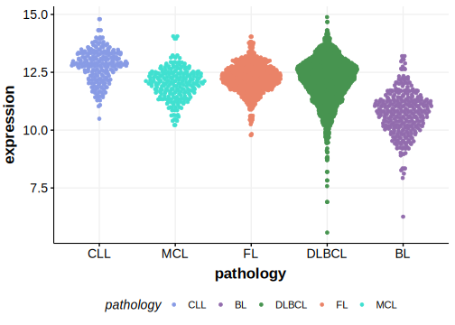

# NLRC5

## Relevance tier by entity

|Entity|Tier|Description               |
|:------:|:----:|--------------------------|
| |1   |high-confidence DLBCL gene|

## Mutation incidence in large patient cohorts (GAMBL reanalysis)

|Entity|source        |frequency (%)|
|:------:|:--------------:|:-------------:|
|DLBCL |GAMBL genomes |3.06         |
|DLBCL |Schmitz cohort|8.30         |
|DLBCL |Reddy cohort  |3.70         |
|DLBCL |Chapuy cohort |2.99         |

## Mutation pattern and selective pressure estimates

|Entity|aSHM|Significant selection|dN/dS (missense)|dN/dS (nonsense)|
|:------:|:----:|:---------------------:|:----------------:|:----------------:|
|BL    |No  |No                   |0.602           | 0.000          |
|DLBCL |No  |No                   |0.529           |20.155          |
|FL    |No  |No                   |0.000           | 7.677          |

[[include:browser_NLRC5.md]]

## Expression

<!-- ORIGIN: Unknown -->

## References
