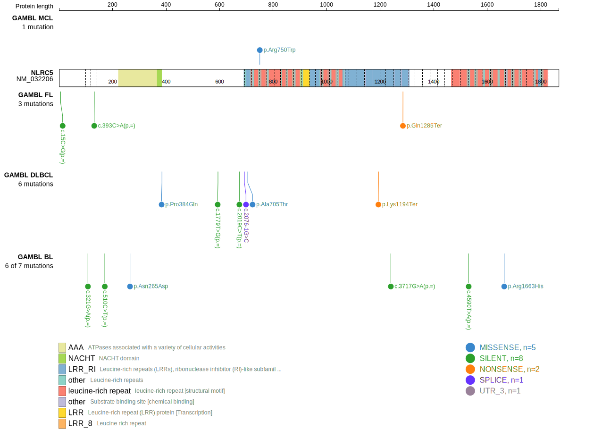
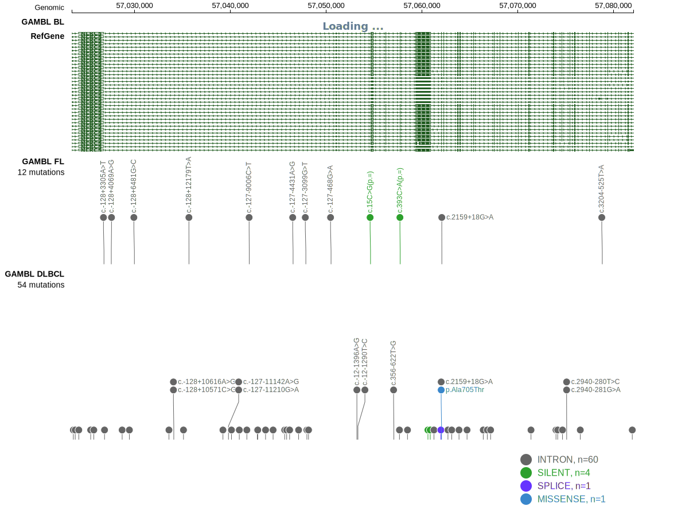

# [NLRC5]

## Mutation tier

|Entity|Tier|Description               |
|:------:|:----:|--------------------------|
|DLBCL |1   |high-confidence DLBCL gene|
## Mutation incidence

|Entity|source        |frequency (%)|
|:------:|:--------------:|:-------------:|
|DLBCL |GAMBL genomes |3.06         |
|DLBCL |Schmitz cohort|8.30         |
|DLBCL |Reddy cohort  |3.70         |
|DLBCL |Chapuy cohort |2.99         |

## Mutation pattern

|Entity|aSHM|Significant selection|dN/dS (missense)|dN/dS (nonsense)|
|:------:|:----:|:---------------------:|:----------------:|:----------------:|
|BL    |No  |No                   |0.602           | 0.000          |
|DLBCL |No  |No                   |0.529           |20.155          |
|FL    |No  |No                   |0.000           | 7.677          |

View coding variants in ProteinPaint [hg19](https://www.bcgsc.ca/downloads/morinlab/GAMBL/test/genes/NLRC5_protein.html)  or [hg38](https://www.bcgsc.ca/downloads/morinlab/GAMBL/test/genes/NLRC5_protein_hg38.html)

View all variants in GenomePaint [hg19](https://www.bcgsc.ca/downloads/morinlab/GAMBL/test/genes/NLRC5.html)  or [hg38](https://www.bcgsc.ca/downloads/morinlab/GAMBL/test/genes/NLRC5_hg38.html)

