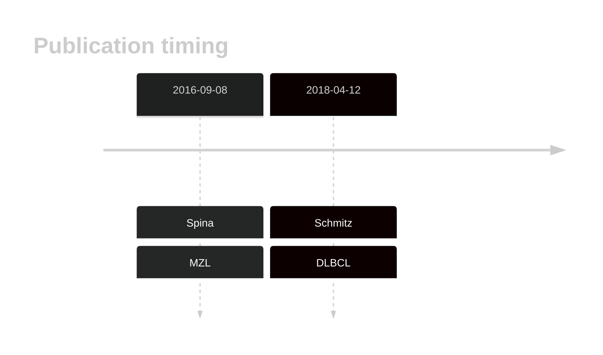
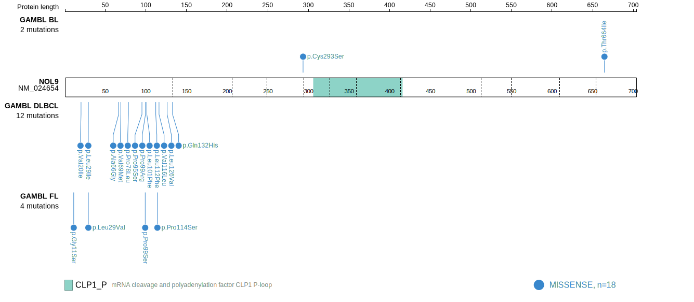
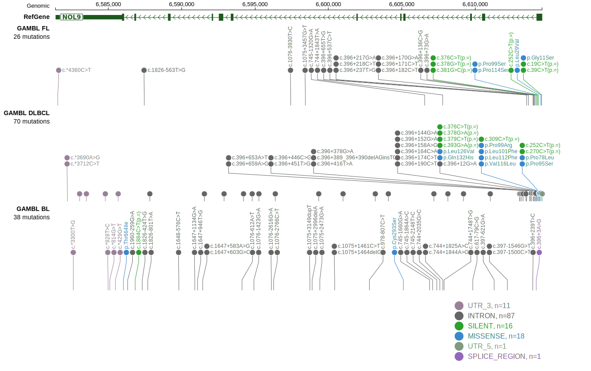

# NOL9

## History

## Relevance tier by entity

|Entity|Tier|Description               |
|:------:|:----:|--------------------------|
||1|high-confidence MZL gene|
| |1   |high-confidence DLBCL gene|

## Mutation incidence in large patient cohorts (GAMBL reanalysis)

|Entity|source        |frequency (%)|
|:------:|:--------------:|:-------------:|
|DLBCL |GAMBL genomes |4.97         |
|DLBCL |Schmitz cohort|6.81         |
|DLBCL |Reddy cohort  |1.30         |
|DLBCL |Chapuy cohort |2.14         |

## Mutation pattern and selective pressure estimates

|Entity|aSHM|Significant selection|dN/dS (missense)|dN/dS (nonsense)|
|:------:|:----:|:---------------------:|:----------------:|:----------------:|
|BL    |No  |No                   |1.514           |0               |
|DLBCL |No  |No                   |4.012           |0               |
|FL    |No  |No                   |2.619           |0               |

 ## NOL9 Hotspots

| Chromosome |Coordinate (hg19) | ref>alt | HGVSp | 
 | :---:| :---: | :--: | :---: |
| chr1 | 6614187 | G>C | L126V |
| chr1 | 6614167 | C>A | Q132H |

View coding variants in ProteinPaint [hg19](https://morinlab.github.io/LLMPP/GAMBL/NOL9_protein.html)  or [hg38](https://morinlab.github.io/LLMPP/GAMBL/NOL9_protein_hg38.html)

View all variants in GenomePaint [hg19](https://morinlab.github.io/LLMPP/GAMBL/NOL9.html)  or [hg38](https://morinlab.github.io/LLMPP/GAMBL/NOL9_hg38.html)

## NOL9 Expression

<!-- ORIGIN: spinaGeneticsNodalMarginal2016b -->
<!-- DLBCL: schmitzGeneticsPathogenesisDiffuse2018a -->
<!-- MZL: spinaGeneticsNodalMarginal2016b -->

## References
1.  Spina V, Khiabanian H, Messina M, Monti S, Cascione L, Bruscaggin A, Spaccarotella E, Holmes AB, Arcaini L, Lucioni M, Tabbò F, Zairis S, Diop F, Cerri M, Chiaretti S, Marasca R, Ponzoni M, Deaglio S, Ramponi A, Tiacci E, Pasqualucci L, Paulli M, Falini B, Inghirami G, Bertoni F, Foà R, Rabadan R, Gaidano G, Rossi D. The genetics of nodal marginal zone lymphoma. Blood. 2016 Sep 8;128(10):1362–1373. 
2.  Schmitz R, Wright GW, Huang DW, Johnson CA, Phelan JD, Wang JQ, Roulland S, Kasbekar M, Young RM, Shaffer AL, Hodson DJ, Xiao W, Yu X, Yang Y, Zhao H, Xu W, Liu X, Zhou B, Du W, Chan WC, Jaffe ES, Gascoyne RD, Connors JM, Campo E, Lopez-Guillermo A, Rosenwald A, Ott G, Delabie J, Rimsza LM, Tay Kuang Wei K, Zelenetz AD, Leonard JP, Bartlett NL, Tran B, Shetty J, Zhao Y, Soppet DR, Pittaluga S, Wilson WH, Staudt LM. Genetics and Pathogenesis of Diffuse Large B-Cell Lymphoma. N Engl J Med. 2018 Apr 12;378(15):1396–1407. PMCID: PMC6010183
