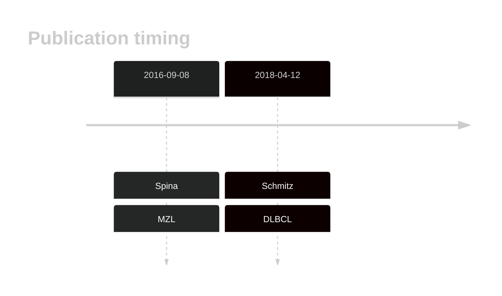

# NOL9

## History

## Relevance tier by entity

|Entity|Tier|Description               |
|:------:|:----:|--------------------------|
||1|high-confidence MZL gene[@spinaGeneticsNodalMarginal2016b]|
| |1   |high-confidence DLBCL gene[@schmitzGeneticsPathogenesisDiffuse2018a]|

## Mutation incidence in large patient cohorts (GAMBL reanalysis)

|Entity|source        |frequency (%)|
|:------:|:--------------:|:-------------:|
|DLBCL |GAMBL genomes |4.97         |
|DLBCL |Schmitz cohort|6.81         |
|DLBCL |Reddy cohort  |1.30         |
|DLBCL |Chapuy cohort |2.14         |

## Mutation pattern and selective pressure estimates

|Entity|aSHM|Significant selection|dN/dS (missense)|dN/dS (nonsense)|
|:------:|:----:|:---------------------:|:----------------:|:----------------:|
|BL    |No  |No                   |1.514           |0               |
|DLBCL |No  |No                   |4.012           |0               |
|FL    |No  |No                   |2.619           |0               |

## NOL9 Hotspots

| Chromosome |Coordinate (hg19) | ref>alt | HGVSp | 
 | :---:| :---: | :--: | :---: |
| chr1 | 6614187 | G>C | L126V |
| chr1 | 6614167 | C>A | Q132H |

View coding variants in ProteinPaint [hg19](https://morinlab.github.io/LLMPP/GAMBL/NOL9_protein.html)  or [hg38](https://morinlab.github.io/LLMPP/GAMBL/NOL9_protein_hg38.html)

View all variants in GenomePaint [hg19](https://morinlab.github.io/LLMPP/GAMBL/NOL9.html)  or [hg38](https://morinlab.github.io/LLMPP/GAMBL/NOL9_hg38.html)

## NOL9 Expression

<!-- ORIGIN: spinaGeneticsNodalMarginal2016b -->
<!-- DLBCL: schmitzGeneticsPathogenesisDiffuse2018a -->
<!-- MZL: spinaGeneticsNodalMarginal2016b -->

## References

