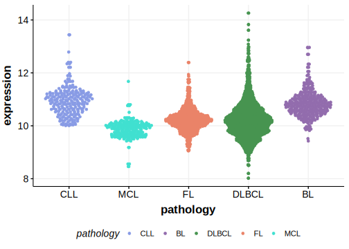

[[_TOC_]]

## Relevance tier by entity

[[include:tables/table1_NOL9.md]]

## Mutation incidence in large patient cohorts (GAMBL reanalysis)

### DLBCL
[[include:tables/DLBCL_NOL9.md]]

## Mutation pattern and selective pressure estimates

[[include:tables/dnds_NOL9.md]]

## NOL9 Hotspots

| Chromosome |Coordinate (hg19) | ref>alt | HGVSp | 
 | :---:| :---: | :--: | :---: |
| chr1 | 6614187 | G>C | L126V |
| chr1 | 6614167 | C>A | Q132H |

[[include:tables/browser_NOL9.md]]

## Expression

<!-- ORIGIN: spinaGeneticsNodalMarginal2016b -->
<!-- DLBCL: schmitzGeneticsPathogenesisDiffuse2018a -->
<!-- MZL: spinaGeneticsNodalMarginal2016b -->

[[include:tables/mermaid_NOL9.md]]

## References

