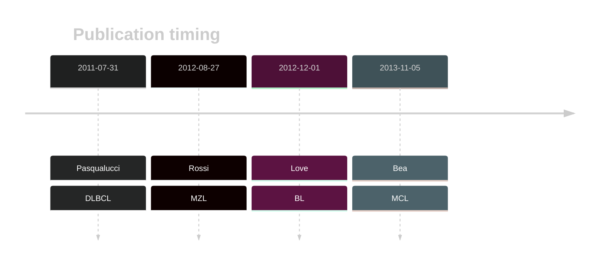

# NOTCH1

## History

## Relevance tier by entity

|Entity|Tier|Description                           |
|:------:|:----:|--------------------------------------|
||1|high-confidence MZL gene|
|    |2   |relevance in BL not firmly established|
| |1   |high-confidence DLBCL gene            |
|   |1   |high-confidence MCL gene              |

## Mutation incidence in large patient cohorts (GAMBL reanalysis)

|Entity|source               |frequency (%)|
|:------:|:---------------------:|:-------------:|
|BL    |GAMBL genomes+capture|4.16         |
|BL    |Thomas cohort        |  NA         |
|BL    |Panea cohort         |  NA         |
|DLBCL |GAMBL genomes        |3.44         |
|DLBCL |Schmitz cohort       |8.94         |
|DLBCL |Reddy cohort         |3.40         |
|DLBCL |Chapuy cohort        |2.99         |
|MCL   |GAMBL genomes        |5.21         |

## Mutation pattern and selective pressure estimates

|Entity|aSHM|Significant selection|dN/dS (missense)|dN/dS (nonsense)|
|:------:|:----:|:---------------------:|:----------------:|:----------------:|
|BL    |No  |No                   |1.031           |0               |
|DLBCL |No  |No                   |0.792           |0               |
|FL    |No  |No                   |2.864           |0               |

 ## NOTCH1 Hotspots

| Chromosome |Coordinate (hg19) | ref>alt | HGVSp | 
 | :---:| :---: | :--: | :---: |
| chr9 | 139401207 | C>T | V1288I |
| chr9 | 139401199 | G>C | D1290E |

View coding variants in ProteinPaint [hg19](https://morinlab.github.io/LLMPP/GAMBL/NOTCH1_protein.html)  or [hg38](https://morinlab.github.io/LLMPP/GAMBL/NOTCH1_protein_hg38.html)

View all variants in GenomePaint [hg19](https://morinlab.github.io/LLMPP/GAMBL/NOTCH1.html)  or [hg38](https://morinlab.github.io/LLMPP/GAMBL/NOTCH1_hg38.html)

## NOTCH1 Expression

<!-- ORIGIN: pasqualucciAnalysisCodingGenome2011 -->
<!-- BL: loveGeneticLandscapeMutations2012 -->
<!-- MZL: rossiCodingGenomeSplenic2012c -->
<!-- MCL: beaLandscapeSomaticMutations2013 -->
<!-- DLBCL: pasqualucciAnalysisCodingGenome2011 -->

## References
1.  Pasqualucci L, Trifonov V, Fabbri G, Ma J, Rossi D, Chiarenza A, Wells VA, Grunn A, Messina M, Elliot O, Chan J, Bhagat G, Chadburn A, Gaidano G, Mullighan CG, Rabadan R, Dalla-Favera R. Analysis of the coding genome of diffuse large B-cell lymphoma. Nat Genet. 2011 Jul 31;43(9):830–837. PMCID: PMC3297422
2.  Rossi D, Trifonov V, Fangazio M, Bruscaggin A, Rasi S, Spina V, Monti S, Vaisitti T, Arruga F, Famà R, Ciardullo C, Greco M, Cresta S, Piranda D, Holmes A, Fabbri G, Messina M, Rinaldi A, Wang J, Agostinelli C, Piccaluga PP, Lucioni M, Tabbò F, Serra R, Franceschetti S, Deambrogi C, Daniele G, Gattei V, Marasca R, Facchetti F, Arcaini L, Inghirami G, Bertoni F, Pileri SA, Deaglio S, Foà R, Dalla-Favera R, Pasqualucci L, Rabadan R, Gaidano G. The coding genome of splenic marginal zone lymphoma: activation of NOTCH2 and other pathways regulating marginal zone development. J Exp Med. 2012 Aug 27;209(9):1537–1551. PMCID: PMC3428941
3.  Love C, Sun Z, Jima D, Li G, Zhang J, Miles R, Richards KL, Dunphy CH, Choi WWL, Srivastava G, Lugar PL, Rizzieri DA, Lagoo AS, Bernal-Mizrachi L, Mann KP, Flowers CR, Naresh KN, Evens AM, Chadburn A, Gordon LI, Czader MB, Gill JI, Hsi ED, Greenough A, Moffitt AB, McKinney M, Banerjee A, Grubor V, Levy S, Dunson DB, Dave SS. The genetic landscape of mutations in Burkitt lymphoma. Nat Genet. 2012 Dec;44(12):1321–1325. PMCID: PMC3674561
4.  Beà S, Valdés-Mas R, Navarro A, Salaverria I, Martín-Garcia D, Jares P, Giné E, Pinyol M, Royo C, Nadeu F, Conde L, Juan M, Clot G, Vizán P, Croce LD, Puente DA, López-Guerra M, Moros A, Roue G, Aymerich M, Villamor N, Colomo L, Martínez A, Valera A, Martín-Subero JI, Amador V, Hernández L, Rozman M, Enjuanes A, Forcada P, Muntañola A, Hartmann EM, Calasanz MJ, Rosenwald A, Ott G, Hernández-Rivas JM, Klapper W, Siebert R, Wiestner A, Wilson WH, Colomer D, López-Guillermo A, López-Otín C, Puente XS, Campo E. Landscape of somatic mutations and clonal evolution in mantle cell lymphoma. PNAS. 2013 Nov 5;110(45):18250–18255. PMID: 24145436
