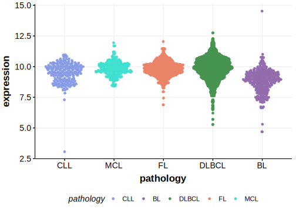
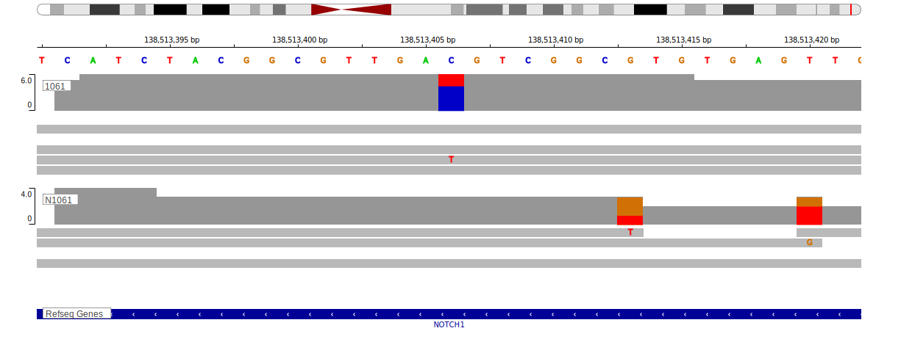

[[_TOC_]]

## Overview
The relevance of NOTCH1 mutations in various malignancies has been well established. However, *due to [minimal support](NOTCH1#representative-mutations) in the original primary data and very few mutations reported in subsequent BL studies, this gene is very unlikely to be relevant in BL.* 
<<Warn("The variants reported in this gene in BL failed QC")>>

## Relevance tier by entity

|Entity|Tier|Description                           |
|:------:|:----:|--------------------------------------|
||1|high-confidence MZL gene[@rossiCodingGenomeSplenic2012]|
|    |3  |Retired, Failed QC[@loveGeneticLandscapeMutations2012]|
| |1   |high-confidence DLBCL gene            |
|   |1   |high-confidence MCL gene              |

## Mutation incidence in large patient cohorts (GAMBL reanalysis)

[[include:DLBCL_NOTCH1.md]]
[[include:BL_NOTCH1.md]]

## Mutation pattern and selective pressure estimates

[[include:dnds_NOTCH1.md]]

## NOTCH1 Hotspots

| Chromosome |Coordinate (hg19) | ref>alt | HGVSp | 
 | :---:| :---: | :--: | :---: |
| chr9 | 139401207 | C>T | V1288I |
| chr9 | 139401199 | G>C | D1290E |

[[include:browser_NOTCH1.md]]

## Expression

<!-- ORIGIN: pasqualucciAnalysisCodingGenome2011 -->
<!-- BL: loveGeneticLandscapeMutations2012 -->
<!-- MZL: rossiCodingGenomeSplenic2012c -->
<!-- MCL: beaLandscapeSomaticMutations2013 -->
<!-- DLBCL: pasqualucciAnalysisCodingGenome2011 -->

## Representative Mutations

## BL3

**Rating**
&starf; &star; &star; &star; &star;

## All Mutations

### BL3

[1061](https://www.bcgsc.ca/downloads/morinlab/GAMBL/Love/1061_reports.html)
[1096](https://www.bcgsc.ca/downloads/morinlab/GAMBL/Love/1096_reports.html)
[324](https://www.bcgsc.ca/downloads/morinlab/GAMBL/Love/324_reports.html)
[508](https://www.bcgsc.ca/downloads/morinlab/GAMBL/Love/508_reports.html)
[513](https://www.bcgsc.ca/downloads/morinlab/GAMBL/Love/513_reports.html)

[[include:mermaid_NOTCH1.md]]

## References

