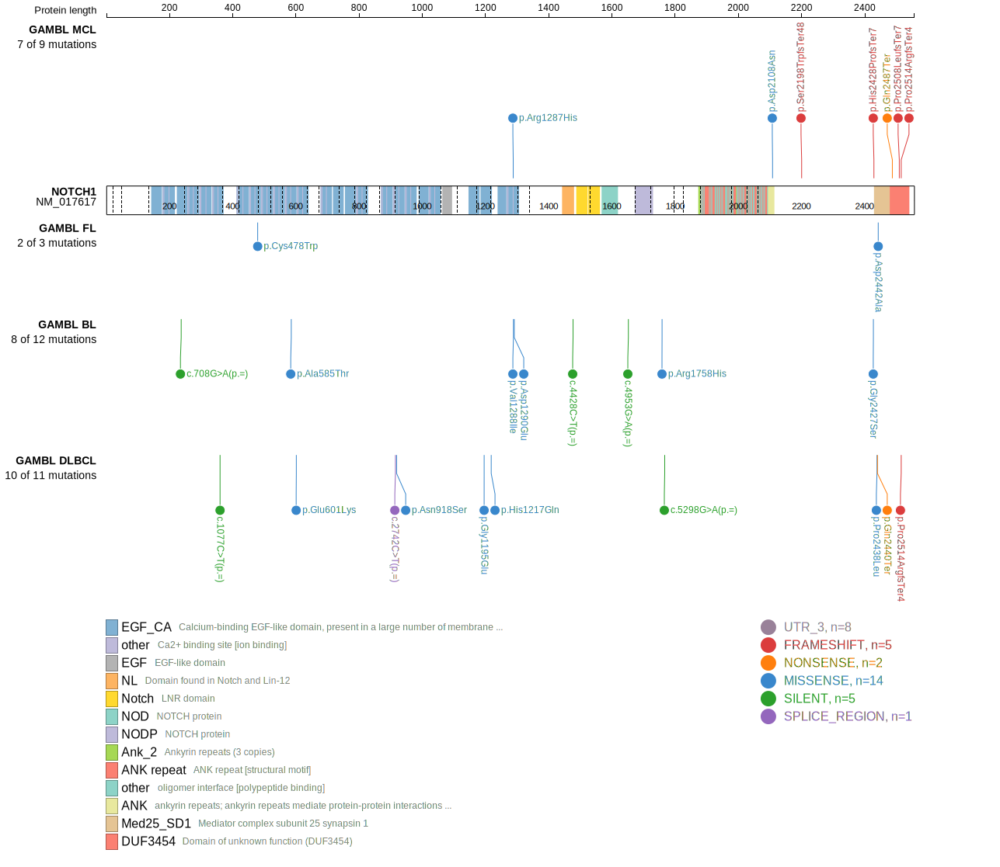
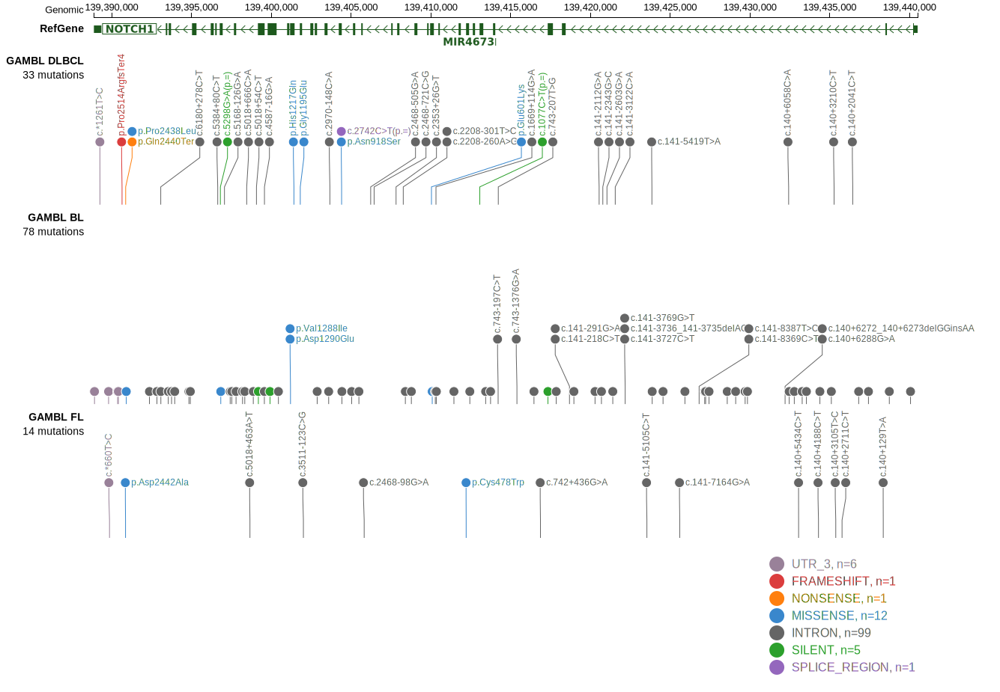

# [NOTCH1]

## Mutation tier

|Entity|Tier|Description                           |
|:------:|:----:|--------------------------------------|
|BL    |2   |relevance in BL not firmly established|
|DLBCL |1   |high-confidence DLBCL gene            |
|MCL   |1   |high-confidence MCL gene              |
## Mutation incidence

|Entity|source               |frequency (%)|
|:------:|:---------------------:|:-------------:|
|BL    |GAMBL genomes+capture|4.16         |
|BL    |Thomas cohort        |  NA         |
|BL    |Panea cohort         |  NA         |
|DLBCL |GAMBL genomes        |3.44         |
|DLBCL |Schmitz cohort       |8.94         |
|DLBCL |Reddy cohort         |3.40         |
|DLBCL |Chapuy cohort        |2.99         |
|MCL   |GAMBL genomes        |5.21         |

## Mutation pattern

|Entity|aSHM|Significant selection|dN/dS (missense)|dN/dS (nonsense)|
|:------:|:----:|:---------------------:|:----------------:|:----------------:|
|BL    |No  |No                   |1.031           |0               |
|DLBCL |No  |No                   |0.792           |0               |
|FL    |No  |No                   |2.864           |0               |

> [!NOTE]
> First described in BL in 2012 by [Love C](https://pubmed.ncbi.nlm.nih.gov/23143597). First described in DLBCL in 2011 by [Pasqualucci L](https://pubmed.ncbi.nlm.nih.gov/21804550). First described in MCL in 2013 by [Beà S](https://pubmed.ncbi.nlm.nih.gov/24145436)

 ## NOTCH1 Hotspots

| Chromosome |Coordinate (hg19) | ref>alt | HGVSp | 
 | :---:| :---: | :--: | :---: |
| chr9 | 139401207 | C>T | V1288I |
| chr9 | 139401199 | G>C | D1290E |

View coding variants in ProteinPaint [hg19](https://www.bcgsc.ca/downloads/morinlab/GAMBL/test/genes/NOTCH1_protein.html)  or [hg38](https://www.bcgsc.ca/downloads/morinlab/GAMBL/test/genes/NOTCH1_protein_hg38.html)

View all variants in GenomePaint [hg19](https://www.bcgsc.ca/downloads/morinlab/GAMBL/test/genes/NOTCH1.html)  or [hg38](https://www.bcgsc.ca/downloads/morinlab/GAMBL/test/genes/NOTCH1_hg38.html)

