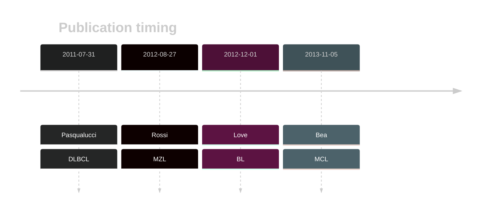

# NOTCH1

## Overview
The relevance of NOTCH1 mutations in various malignancies has been well established. However, *due to [minimal support](NOTCH1#representative-mutations) in the original primary data and very few mutations reported in subsequent BL studies, this gene is very unlikely to be relevant in BL.* 
<<Warn("The variants reported in this gene in BL failed QC")>>

## History

## Relevance tier by entity

|Entity|Tier|Description                           |
|:------:|:----:|--------------------------------------|
||1|high-confidence MZL gene[@rossiCodingGenomeSplenic2012c]|
|    |3  |Retired, Failed QC[@loveGeneticLandscapeMutations2012]|
| |1   |high-confidence DLBCL gene            |
|   |1   |high-confidence MCL gene              |

## Mutation incidence in large patient cohorts (GAMBL reanalysis)

|Entity|source               |frequency (%)|
|:------:|:---------------------:|:-------------:|
|BL    |GAMBL genomes+capture|4.16         |
|BL    |Thomas cohort        |  NA         |
|BL    |Panea cohort         |  NA         |
|DLBCL |GAMBL genomes        |3.44         |
|DLBCL |Schmitz cohort       |8.94         |
|DLBCL |Reddy cohort         |3.40         |
|DLBCL |Chapuy cohort        |2.99         |
|MCL   |GAMBL genomes        |5.21         |

## Mutation pattern and selective pressure estimates

|Entity|aSHM|Significant selection|dN/dS (missense)|dN/dS (nonsense)|
|:------:|:----:|:---------------------:|:----------------:|:----------------:|
|BL    |No  |No                   |1.031           |0               |
|DLBCL |No  |No                   |0.792           |0               |
|FL    |No  |No                   |2.864           |0               |

## NOTCH1 Hotspots

| Chromosome |Coordinate (hg19) | ref>alt | HGVSp | 
 | :---:| :---: | :--: | :---: |
| chr9 | 139401207 | C>T | V1288I |
| chr9 | 139401199 | G>C | D1290E |

View coding variants in ProteinPaint [hg19](https://morinlab.github.io/LLMPP/GAMBL/NOTCH1_protein.html)  or [hg38](https://morinlab.github.io/LLMPP/GAMBL/NOTCH1_protein_hg38.html)

View all variants in GenomePaint [hg19](https://morinlab.github.io/LLMPP/GAMBL/NOTCH1.html)  or [hg38](https://morinlab.github.io/LLMPP/GAMBL/NOTCH1_hg38.html)

## NOTCH1 Expression

<!-- ORIGIN: pasqualucciAnalysisCodingGenome2011 -->
<!-- BL: loveGeneticLandscapeMutations2012 -->
<!-- MZL: rossiCodingGenomeSplenic2012c -->
<!-- MCL: beaLandscapeSomaticMutations2013 -->
<!-- DLBCL: pasqualucciAnalysisCodingGenome2011 -->

## Representative Mutations

## BL3

**Rating**
&starf; &star; &star; &star; &star;

## All Mutations

### BL3

[1061](https://www.bcgsc.ca/downloads/morinlab/GAMBL/Love/1061_reports.html)
[1096](https://www.bcgsc.ca/downloads/morinlab/GAMBL/Love/1096_reports.html)
[324](https://www.bcgsc.ca/downloads/morinlab/GAMBL/Love/324_reports.html)
[508](https://www.bcgsc.ca/downloads/morinlab/GAMBL/Love/508_reports.html)
[513](https://www.bcgsc.ca/downloads/morinlab/GAMBL/Love/513_reports.html)

## References

