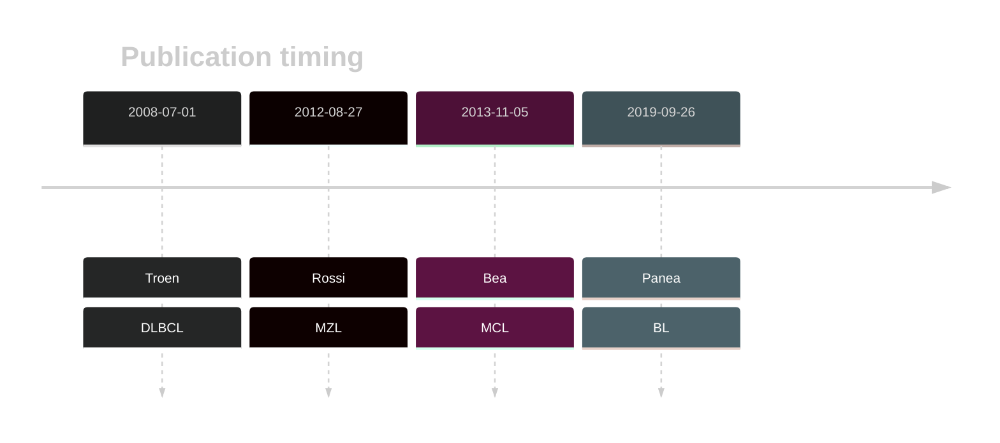

# NOTCH2

## History

## Relevance tier by entity

|Entity|Tier|Description                           |
|:------:|:----:|--------------------------------------|
||1|high-confidence MZL gene|
|    |2   |relevance in BL not firmly established|
| |1   |high-confidence DLBCL gene            |
|   |1   |high-confidence MCL gene              |

## Mutation incidence in large patient cohorts (GAMBL reanalysis)

|Entity|source               |frequency (%)|
|:------:|:---------------------:|:-------------:|
|BL    |GAMBL genomes+capture| 1.15        |
|BL    |Thomas cohort        | 0.00        |
|BL    |Panea cohort         | 5.00        |
|DLBCL |GAMBL genomes        | 5.74        |
|DLBCL |Schmitz cohort       |11.28        |
|DLBCL |Reddy cohort         | 3.70        |
|DLBCL |Chapuy cohort        | 7.26        |
|MCL   |GAMBL genomes        | 2.84        |

## Mutation pattern and selective pressure estimates

|Entity|aSHM|Significant selection|dN/dS (missense)|dN/dS (nonsense)|
|:------:|:----:|:---------------------:|:----------------:|:----------------:|
|BL    |No  |No                   |0.000           | 0.000          |
|DLBCL |No  |Yes                  |0.527           |60.245          |
|FL    |No  |No                   |0.000           | 0.000          |

## NOTCH2 Hotspots

| Chromosome |Coordinate (hg19) | ref>alt | HGVSp | 
 | :---:| :---: | :--: | :---: |
| chr1 | 120458147 | G>A | R2400* |

View coding variants in ProteinPaint [hg19](https://morinlab.github.io/LLMPP/GAMBL/NOTCH2_protein.html)  or [hg38](https://morinlab.github.io/LLMPP/GAMBL/NOTCH2_protein_hg38.html)

View all variants in GenomePaint [hg19](https://morinlab.github.io/LLMPP/GAMBL/NOTCH2.html)  or [hg38](https://morinlab.github.io/LLMPP/GAMBL/NOTCH2_hg38.html)

## NOTCH2 Expression

<!-- ORIGIN: 18508802 -->
<!-- DLBCL: troenNOTCH2MutationsMarginal2008 -->
<!-- MCL: beaLandscapeSomaticMutations2013 -->
<!-- MZL: rossiCodingGenomeSplenic2012c -->
<!-- BL: paneaWholeGenomeLandscape2019 -->

## References
1.  Trøen G, Wlodarska I, Warsame A, Hernández Llodrà S, De Wolf-Peeters C, Delabie J. NOTCH2 mutations in marginal zone lymphoma. Haematologica. 2008 Jul;93(7):1107–1109. PMID: 18508802
2.  Rossi D, Trifonov V, Fangazio M, Bruscaggin A, Rasi S, Spina V, Monti S, Vaisitti T, Arruga F, Famà R, Ciardullo C, Greco M, Cresta S, Piranda D, Holmes A, Fabbri G, Messina M, Rinaldi A, Wang J, Agostinelli C, Piccaluga PP, Lucioni M, Tabbò F, Serra R, Franceschetti S, Deambrogi C, Daniele G, Gattei V, Marasca R, Facchetti F, Arcaini L, Inghirami G, Bertoni F, Pileri SA, Deaglio S, Foà R, Dalla-Favera R, Pasqualucci L, Rabadan R, Gaidano G. The coding genome of splenic marginal zone lymphoma: activation of NOTCH2 and other pathways regulating marginal zone development. J Exp Med. 2012 Aug 27;209(9):1537–1551. PMCID: PMC3428941
3.  Beà S, Valdés-Mas R, Navarro A, Salaverria I, Martín-Garcia D, Jares P, Giné E, Pinyol M, Royo C, Nadeu F, Conde L, Juan M, Clot G, Vizán P, Croce LD, Puente DA, López-Guerra M, Moros A, Roue G, Aymerich M, Villamor N, Colomo L, Martínez A, Valera A, Martín-Subero JI, Amador V, Hernández L, Rozman M, Enjuanes A, Forcada P, Muntañola A, Hartmann EM, Calasanz MJ, Rosenwald A, Ott G, Hernández-Rivas JM, Klapper W, Siebert R, Wiestner A, Wilson WH, Colomer D, López-Guillermo A, López-Otín C, Puente XS, Campo E. Landscape of somatic mutations and clonal evolution in mantle cell lymphoma. PNAS. 2013 Nov 5;110(45):18250–18255. PMID: 24145436
4.  Panea R, Love C, Shingleton JR, Reddy A, Bailey J, Moormann A, Otieno J, Ong’echa J, Oduor C, Schroêder K, Masalu N, Chao N, Agajanian M, Major M, Fedoriw Y, Richards K, Rymkiewicz G, Miles R, Alobeid B, Bhagat G, Flowers C, Ondrejka S, Hsi E, Choi W, Au-Yeung R, Hartmann W, Lenz G, Meyerson H, Lin YY, Zhuang Y, Luftig M, Waldrop A, Dave T, Thakkar D, Sahay H, Li G, Palus B, Seshadri V, Kim S, Gascoyne R, Levy S, Mukhopadhyay M, Dunson D, Dave S. The whole genome landscape of Burkitt lymphoma subtypes. Blood. 2019; 
