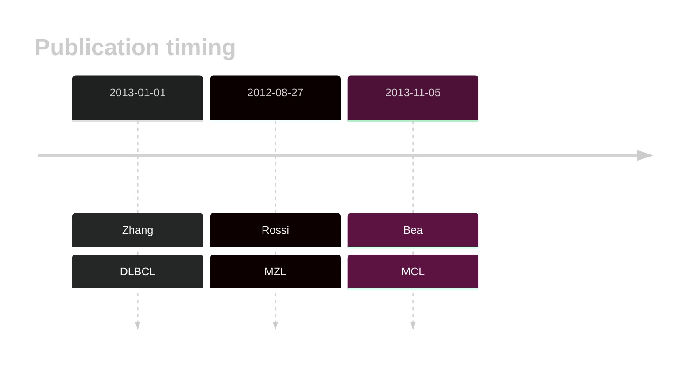
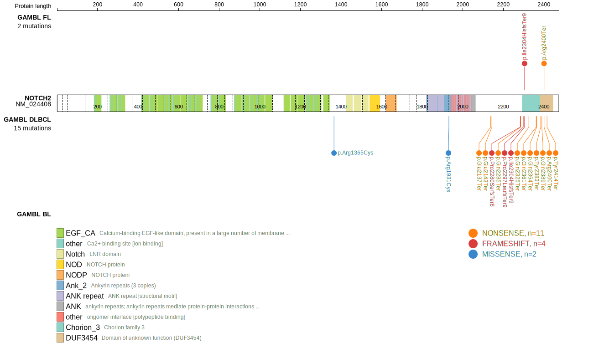
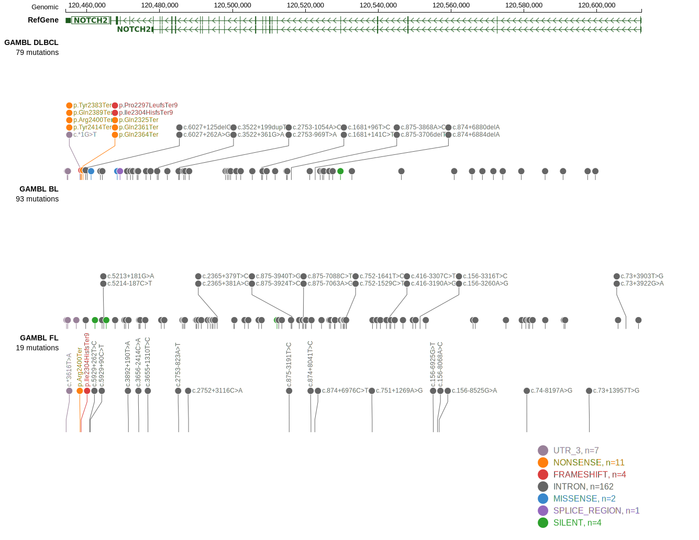
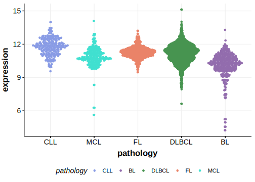

# NOTCH2

## History

## Relevance tier by entity

|Entity|Tier|Description                           |
|:------:|:----:|--------------------------------------|
||1|high-confidence MZL gene[@rossiCodingGenomeSplenic2012c]|
| |1   |high-confidence DLBCL gene            [@zhangGeneticHeterogeneityDiffuse2013]|
|   |1   |high-confidence MCL gene              [@beaLandscapeSomaticMutations2013]|

## Mutation incidence in large patient cohorts (GAMBL reanalysis)

|Entity|source               |frequency (%)|
|:------:|:---------------------:|:-------------:|
|DLBCL |GAMBL genomes        | 5.74        |
|DLBCL |Schmitz cohort       |11.28        |
|DLBCL |Reddy cohort         | 3.70        |
|DLBCL |Chapuy cohort        | 7.26        |
|MCL   |GAMBL genomes        | 2.84        |

## Mutation pattern and selective pressure estimates

|Entity|aSHM|Significant selection|dN/dS (missense)|dN/dS (nonsense)|
|:------:|:----:|:---------------------:|:----------------:|:----------------:|
|BL    |No  |No                   |0.000           | 0.000          |
|DLBCL |No  |Yes                  |0.527           |60.245          |
|FL    |No  |No                   |0.000           | 0.000          |

## NOTCH2 Hotspots

| Chromosome |Coordinate (hg19) | ref>alt | HGVSp | 
 | :---:| :---: | :--: | :---: |
| chr1 | 120458147 | G>A | R2400* |

View coding variants in ProteinPaint [hg19](https://morinlab.github.io/LLMPP/GAMBL/NOTCH2_protein.html)  or [hg38](https://morinlab.github.io/LLMPP/GAMBL/NOTCH2_protein_hg38.html)

View all variants in GenomePaint [hg19](https://morinlab.github.io/LLMPP/GAMBL/NOTCH2.html)  or [hg38](https://morinlab.github.io/LLMPP/GAMBL/NOTCH2_hg38.html)

## NOTCH2 Expression

<!-- ORIGIN: 18508802 -->
<!-- DLBCL: troenNOTCH2MutationsMarginal2008 -->
<!-- MCL: beaLandscapeSomaticMutations2013 -->
<!-- MZL: rossiCodingGenomeSplenic2012c -->

## References
