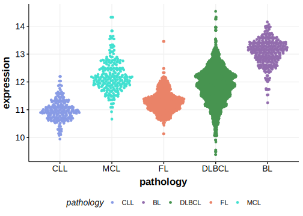

[[_TOC_]]

## Relevance tier by entity

[[include:tables/table1_NSD2.md]]

## Mutation incidence in large patient cohorts (GAMBL reanalysis)

### MCL
[[include:tables/MCL_NSD2]]

### DLBCL
[[include:tables/DLBCL_NSD2]]

<!---
## Mutation pattern and selective pressure estimates

-->

[[include:tables/browser_NSD2.md]]

## Expression

<!-- ORIGIN: beaLandscapeSomaticMutations2013 -->
<!-- MCL: beaLandscapeSomaticMutations2013 -->

[[include:tables/mermaid_NSD2.md]]

## References

