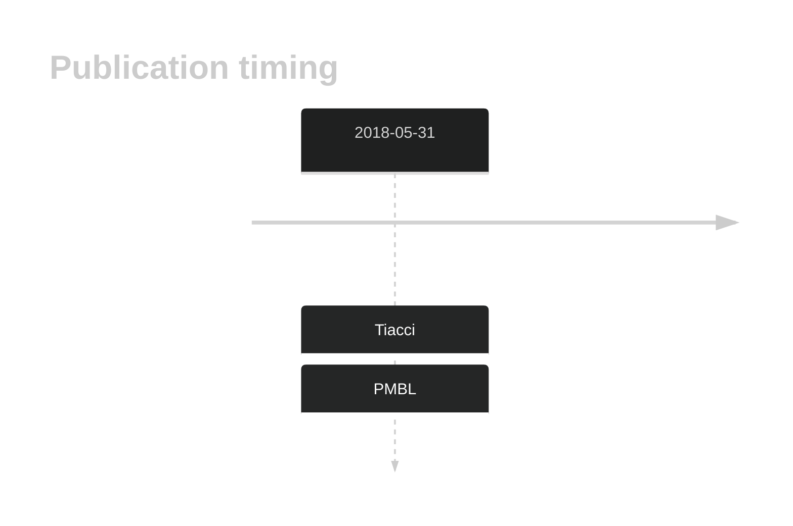

# NUP214

## History

## Relevance tier by entity

|Entity|Tier|Description|
|:------:|:----:|--------------------------------------|
||2|relevance in PMBL/cHL/GZL not firmly established[@tiacciPervasiveMutationsJAKSTAT2018]|

## Mutation incidence in large patient cohorts (GAMBL reanalysis)

|Entity|source |frequency (%)|
|:------:|:----:|:----:|
|BL|GAMBL Exome |6.897 |
|BL|GAMBL Genome |0.772 |
|DLBCL|GAMBL Exome |3.073 |
|DLBCL|GAMBL Genome |0.752 |
|FL|GAMBL Exome |1.146 |
|MCL|GAMBL Genome |2.339 |

## References

