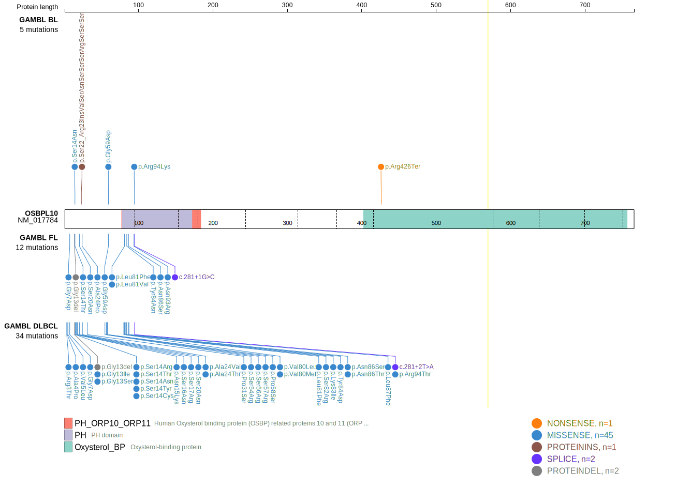
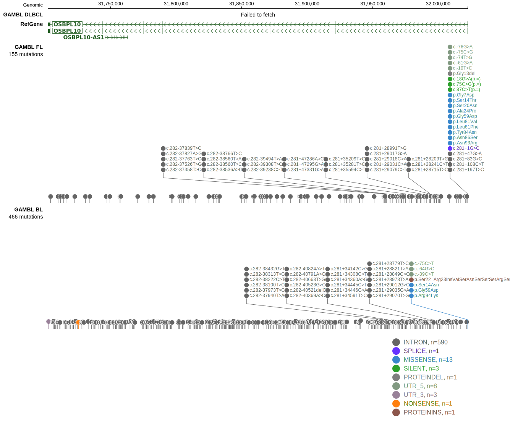

OSBPL10 is one of [a number of genes](https://github.com/morinlab/LLMPP/wiki/ashm) affected by aberrant somatic hypermutation in B-cell lymphomas, which complicates the interpretation of mutations at this locus.

## Mutation tier

|Entity|Tier|Description                           |
|:------:|:----:|--------------------------------------|
|BL    |2-a | aSHM target; Although recurrent, the relevance of mutations in BL is tenuous |
|DLBCL |1-a | aSHM target and high-confidence DLBCL gene            |
## Mutation incidence

|Entity|source               |frequency (%)|
|:------:|:---------------------:|:-------------:|
|BL    |GAMBL genomes+capture| 2.08        |
|BL    |Thomas cohort        | 2.10        |
|BL    |Panea cohort         | 3.00        |
|DLBCL |GAMBL genomes        | 8.80        |
|DLBCL |Schmitz cohort       |14.26        |
|DLBCL |Reddy cohort         | 2.30        |
|DLBCL |Chapuy cohort        | 2.56        |

## Mutation pattern

|Entity|aSHM|Significant selection|dN/dS (missense)|dN/dS (nonsense)|
|:------:|:----:|:---------------------:|:----------------:|:----------------:|
|BL    |Yes |No                   | 4.102          |11.721          |
|DLBCL |Yes |Yes                  |12.983          | 0.000          |
|FL    |Yes |Yes                  | 5.877          | 8.779          |

## aSHM regions

|chr_name|hg19_start|hg19_end|region                                                                                     |regulatory_comment|
|:--------:|:----------:|:--------:|:-------------------------------------------------------------------------------------------:|:------------------:|
|chr3    |32020518  |32024930|[TSS-1](https://genome.ucsc.edu/s/rdmorin/GAMBL%20hg19?position=chr3%3A32020518%2D32024930)|active_promoter   |

View coding variants in ProteinPaint [hg19](https://www.bcgsc.ca/downloads/morinlab/GAMBL/test/genes/OSBPL10_protein.html)  or [hg38](https://www.bcgsc.ca/downloads/morinlab/GAMBL/test/genes/OSBPL10_protein_hg38.html)

View all variants in GenomePaint [hg19](https://www.bcgsc.ca/downloads/morinlab/GAMBL/test/genes/OSBPL10.html)  or [hg38](https://www.bcgsc.ca/downloads/morinlab/GAMBL/test/genes/OSBPL10_hg38.html)

