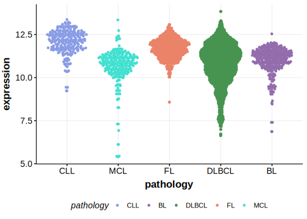

[[_TOC_]]

## Overview
OSBPL10 is one of [a number of genes](https://github.com/morinlab/LLMPP/wiki/ashm) affected by aberrant somatic hypermutation in B-cell lymphomas, which complicates the interpretation of mutations at this locus.

## Relevance tier by entity

[[include:table1_OSBPL10.md]]

## Mutation incidence in large patient cohorts (GAMBL reanalysis)

### DLBCL
[[include:tables/DLBCL_OSBPL10.md]]

## Mutation pattern and selective pressure estimates

[[include:tables/dnds_OSBPL10.md]]

## aSHM regions

|chr_name|hg19_start|hg19_end|region                                                                                     |regulatory_comment|
|:--------:|:----------:|:--------:|:-------------------------------------------------------------------------------------------:|:------------------:|
|chr3    |32020518  |32024930|[TSS-1](https://genome.ucsc.edu/s/rdmorin/GAMBL%20hg19?position=chr3%3A32020518%2D32024930)|active_promoter   |

[[include:browser_OSBPL10.md]]

## Expression

<!-- ORIGIN: arthurGenomewideDiscoverySomatic2018 -->
<!-- DLBCL: arthurGenomewideDiscoverySomatic2018 -->

[[include:mermaid_OSBPL10.md]]

## References

