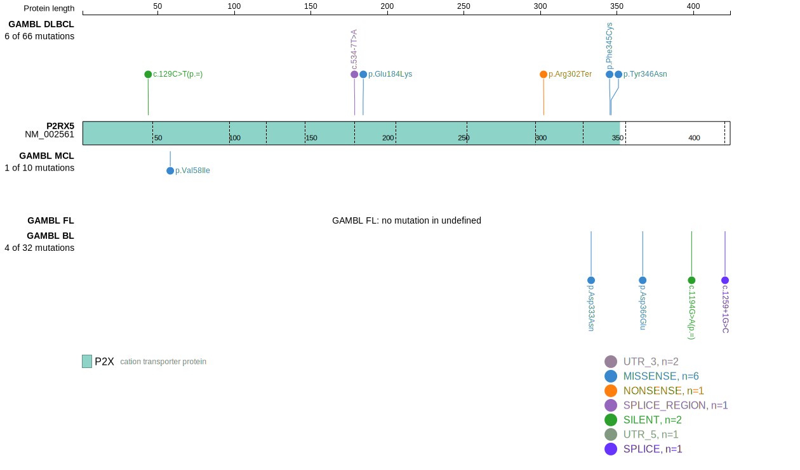
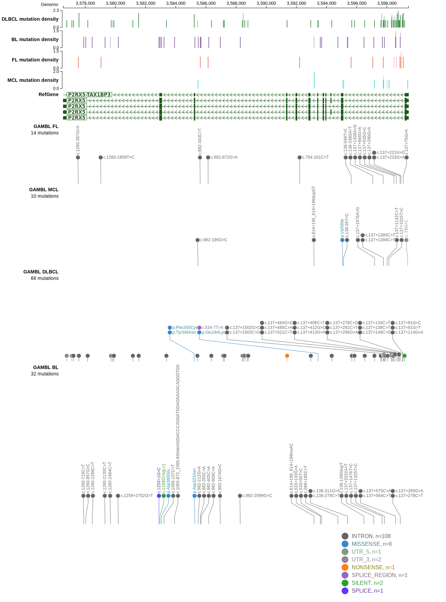
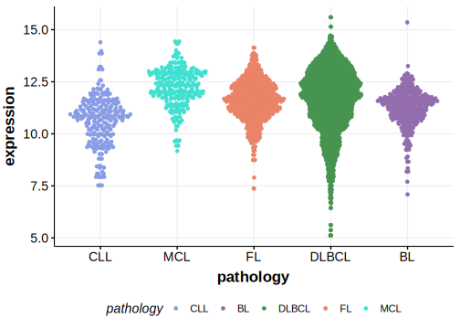

# P2RX5

## Relevance tier by entity

|Entity|Tier|Description                              |
|:------:|:----:|-----------------------------------------|
| |2-a | aSHM target; Although recurrent, the relevance of mutations in DLBCL is tenuous |

## Mutation incidence in large patient cohorts (GAMBL reanalysis)

|Entity|source        |frequency (%)|
|:------:|:--------------:|:-------------:|
|DLBCL |GAMBL genomes |1.15         |
|DLBCL |Schmitz cohort|1.70         |
|DLBCL |Reddy cohort  |1.60         |
|DLBCL |Chapuy cohort |0.85         |

## Mutation pattern and selective pressure estimates

|Entity|aSHM|Significant selection|dN/dS (missense)|dN/dS (nonsense)|
|:------:|:----:|:---------------------:|:----------------:|:----------------:|
|BL    |Yes |No                   |2.368           |12.182          |
|DLBCL |Yes |No                   |4.647           |21.997          |
|FL    |Yes |No                   |0.000           | 0.000          |

## aSHM regions

|chr_name|hg19_start|hg19_end|region                                                                                  |regulatory_comment|
|:--------:|:----------:|:--------:|:----------------------------------------------------------------------------------------:|:------------------:|
|chr17   |3597616   |3599572 |[TSS](https://genome.ucsc.edu/s/rdmorin/GAMBL%20hg19?position=chr17%3A3597616%2D3599572)|active_promoter   |

> [!NOTE]
> First described in DLBCL in 2013 by [Morin RD](https://pubmed.ncbi.nlm.nih.gov/23699601)

View coding variants in ProteinPaint [hg19](https://morinlab.github.io/LLMPP/GAMBL/P2RX5_protein.html)  or [hg38](https://morinlab.github.io/LLMPP/GAMBL/P2RX5_protein_hg38.html)

View all variants in GenomePaint [hg19](https://morinlab.github.io/LLMPP/GAMBL/P2RX5.html)  or [hg38](https://morinlab.github.io/LLMPP/GAMBL/P2RX5_hg38.html)

## P2RX5 Expression

<!-- ORIGIN: morinMutationalStructuralAnalysis2013 -->
<!-- DLBCL: morinMutationalStructuralAnalysis2013 -->
