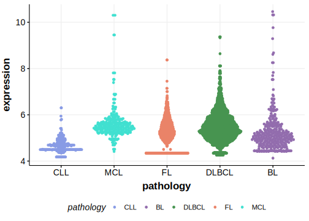
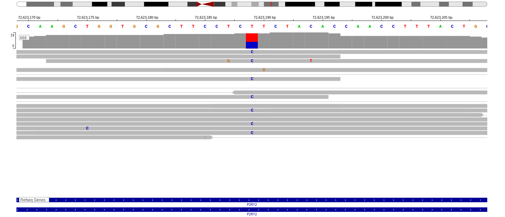

[[_TOC_]]

## Relevance tier by entity

[[include:table1_P2RY2.md]]

## Mutation incidence in large patient cohorts (GAMBL reanalysis)

|Entity|source               |frequency (%)|
|:------:|:---------------------:|:-------------:|
|BL    |GAMBL genomes+capture|1.15         |
|BL    |Thomas cohort        |  NA         |
|BL    |Panea cohort         |  NA         |

## Mutation pattern and selective pressure estimates

[[include:tables/dnds_P2RY2.md]]

[[include:browser_P2RY2.md]]

## Expression

<!-- ORIGIN: loveGeneticLandscapeMutations2012 -->
<!-- BL: loveGeneticLandscapeMutations2012 -->

## Representative Mutation

**Rating**
&starf; &starf; &starf; &starf; &star;

## All Mutations

[1093](https://www.bcgsc.ca/downloads/morinlab/GAMBL/Love/1093_reports.html)
[668](https://www.bcgsc.ca/downloads/morinlab/GAMBL/Love/668_reports.html)

[[include:tables/mermaid_P2RY2.md]]

## References

