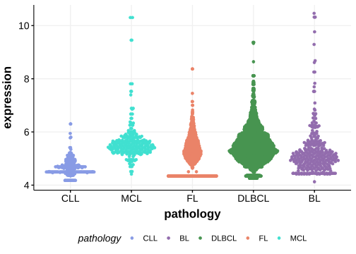
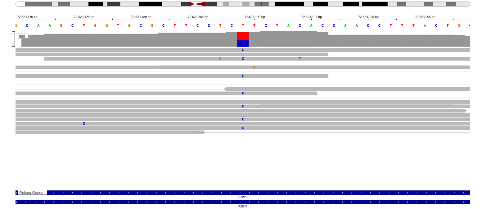

[[_TOC_]]

## Relevance tier by entity

[[include:tables/table1_P2RY2.md]]

## Mutation incidence in large patient cohorts (GAMBL reanalysis)

### BL
[[include:tables/BL_P2RY2.md]]

### DLBCL
[[include:tables/DLBCL_P2RY2.md]]

### FL
[[include:tables/FL_P2RY2.md]]

## Mutation pattern and selective pressure estimates

[[include:tables/dnds_P2RY2.md]]

[[include:tables/browser_P2RY2.md]]

## Expression

<!-- ORIGIN: loveGeneticLandscapeMutations2012 -->
<!-- BL: loveGeneticLandscapeMutations2012 -->

## Representative Mutation

**Rating**
&starf; &starf; &starf; &starf; &star;

## All Mutations

[1093](https://www.bcgsc.ca/downloads/morinlab/GAMBL/Love/1093_reports.html)
[668](https://www.bcgsc.ca/downloads/morinlab/GAMBL/Love/668_reports.html)

[[include:tables/mermaid_P2RY2.md]]

## References

