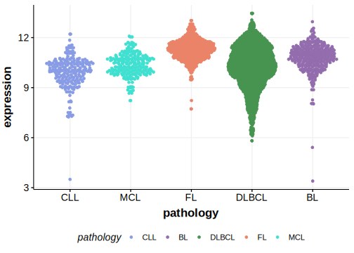

# P2RY8
P2RY8 encodes a G protein–coupled receptor that is expressed on germinal center B cells. Signals through this receptor promote confinement of B cells to the GC niche.1 Downstream signaling through Galpha13 (encoded by GNA13) and S1PR2 is distrupted by mutations of one of these genes in GC lymphomas including the GCB subgroup of DLBCL2 and BL.1 

## History

## Relevance tier by entity

|Entity|Tier|Description                           |
|:------:|:----:|--------------------------------------|
||1|high-confidence PMBL/cHL/GZL gene|
|    |1   |high-confidence BL gene               [@muppidiLossSignalingGa132014b]|
| |1   |high-confidence DLBCL gene            [@lohrDiscoveryPrioritizationSomatic2012a]|
|    |2   |relevance in FL not firmly established|

## Mutation incidence in large patient cohorts (GAMBL reanalysis)

|Entity|source               |frequency (%)|
|:------:|:---------------------:|:-------------:|
|BL    |GAMBL genomes+capture| 6.93        |
|BL    |Thomas cohort        |11.00        |
|BL    |Panea cohort         |   NA        |
|DLBCL |GAMBL genomes        | 6.88        |
|DLBCL |Schmitz cohort       | 7.23        |
|DLBCL |Reddy cohort         |   NA        |
|DLBCL |Chapuy cohort        | 5.98        |
|FL    |GAMBL genomes        | 2.31        |

## Mutation pattern and selective pressure estimates

|Entity|aSHM|Significant selection|dN/dS (missense)|dN/dS (nonsense)|
|:------:|:----:|:---------------------:|:----------------:|:----------------:|
|BL    |No  |Yes                  |58.153          |189.145         |
|DLBCL |No  |Yes                  |31.041          |  0.000         |
|FL    |No  |No                   |23.117          |  0.000         |

View coding variants in ProteinPaint [hg19](https://morinlab.github.io/LLMPP/GAMBL/P2RY8_protein.html)  or [hg38](https://morinlab.github.io/LLMPP/GAMBL/P2RY8_protein_hg38.html)

View all variants in GenomePaint [hg19](https://morinlab.github.io/LLMPP/GAMBL/P2RY8.html)  or [hg38](https://morinlab.github.io/LLMPP/GAMBL/P2RY8_hg38.html)

## P2RY8 Expression

## References

<!-- ORIGIN: lohrDiscoveryPrioritizationSomatic2012a -->
<!-- BL: muppidiLossSignalingGa132014b -->
<!-- DLBCL: lohrDiscoveryPrioritizationSomatic2012a -->
