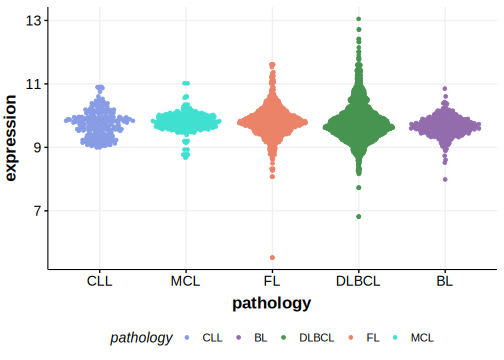

[[_TOC_]]

## Relevance tier by entity

[[include:table1_PAPOLG.md]]

## Mutation incidence in large patient cohorts (GAMBL reanalysis)

|Entity|source        |frequency (%)|
|:------:|:--------------:|:-------------:|
|DLBCL |GAMBL genomes |0.38         |
|DLBCL |Schmitz cohort|0.85         |
|DLBCL |Reddy cohort  |1.20         |
|DLBCL |Chapuy cohort |1.28         |

## Mutation pattern and selective pressure estimates

[[include:tables/dnds_PAPOLG.md]]

[[include:browser_PAPOLG.md]]

## Expression

<!-- ORIGIN: schmitzGeneticsPathogenesisDiffuse2018a -->
<!-- DLBCL: schmitzGeneticsPathogenesisDiffuse2018a -->

[[include:tables/mermaid_PAPOLG.md]]

## References

