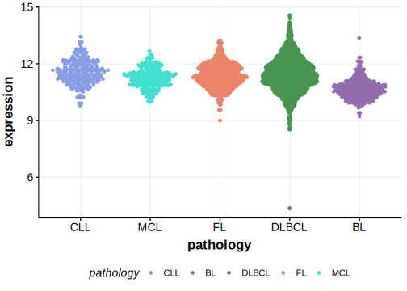

[[_TOC_]]

## Relevance tier by entity

[[include:tables/table1_PASK.md]]

## Mutation incidence in large patient cohorts (GAMBL reanalysis)

|Entity|source        |frequency (%)|
|:------:|:--------------:|:-------------:|
|DLBCL |GAMBL genomes |1.91         |
|DLBCL |Schmitz cohort|2.98         |
|DLBCL |Reddy cohort  |2.00         |
|DLBCL |Chapuy cohort |0.85         |

## Mutation pattern and selective pressure estimates

[[include:tables/dnds_PASK.md]]

[[include:browser_PASK.md]]

## Expression

<!-- ORIGIN: morinMutationalStructuralAnalysis2013 -->
<!-- DLBCL: morinMutationalStructuralAnalysis2013 -->

## All Mutations

[RG043](https://www.bcgsc.ca/downloads/morinlab/GAMBL/Morin_2013/RG043.html)
[RG068](https://www.bcgsc.ca/downloads/morinlab/GAMBL/Morin_2013/RG068.html)
[RG142](https://www.bcgsc.ca/downloads/morinlab/GAMBL/Morin_2013/RG142.html)

[[include:tables/mermaid_PASK.md]]

## References

