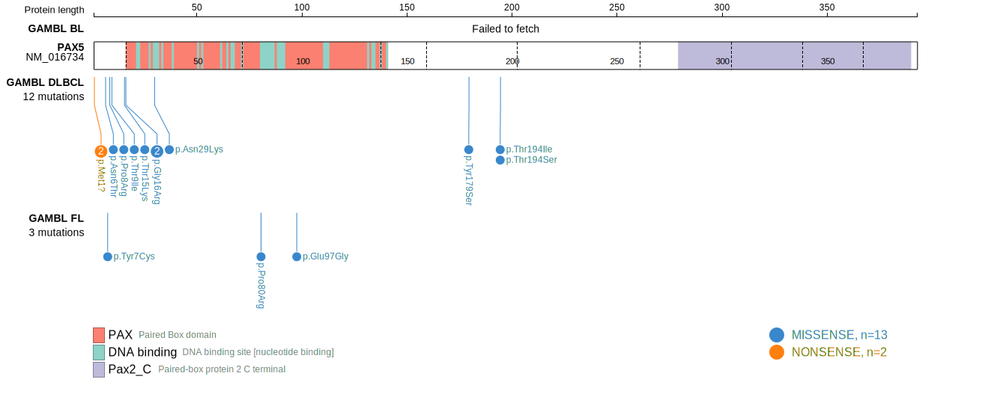
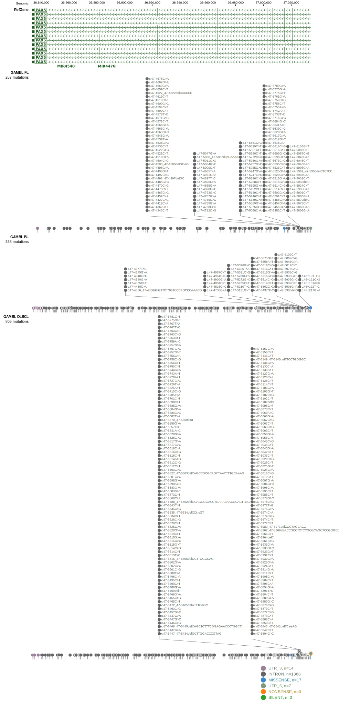

# [PAX5]

## Mutation tier

|Entity|Tier|Description                              |
|:------:|:----:|-----------------------------------------|
|DLBCL |2   |relevance in DLBCL not firmly established|
## Mutation incidence

|Entity|source        |frequency (%)|
|:------:|:--------------:|:-------------:|
|DLBCL |GAMBL genomes |3.63         |
|DLBCL |Schmitz cohort|3.20         |
|DLBCL |Reddy cohort  |1.90         |
|DLBCL |Chapuy cohort |3.40         |

## Mutation pattern

|Entity|aSHM|Significant selection|dN/dS (missense)|dN/dS (nonsense)|
|:------:|:----:|:---------------------:|:----------------:|:----------------:|
|BL    |Yes |No                   | 6.750          |0               |
|DLBCL |Yes |Yes                  |14.089          |0               |
|FL    |Yes |No                   |10.963          |0               |

## aSHM regions

|chr_name|hg19_start|hg19_end|region                                                                                                 |regulatory_comment|
|:--------:|:----------:|:--------:|:-------------------------------------------------------------------------------------------------------:|:------------------:|
|chr9    |37023396  |37027663|[intron-1](https://genome.ucsc.edu/s/rdmorin/GAMBL%20hg19?position=chr9%3A37023396%2D37027663)         |intron            |
|chr9    |37029849  |37037154|[TSS-1](https://genome.ucsc.edu/s/rdmorin/GAMBL%20hg19?position=chr9%3A37029849%2D37037154)            |active_promoter   |
|chr9    |37369209  |37372160|[distal-enhancer-1](https://genome.ucsc.edu/s/rdmorin/GAMBL%20hg19?position=chr9%3A37369209%2D37372160)|enhancer          |
|chr9    |37382267  |37385854|[distal-enhancer-2](https://genome.ucsc.edu/s/rdmorin/GAMBL%20hg19?position=chr9%3A37382267%2D37385854)|enhancer          |
|chr9    |37395932  |37409239|[distal-enhancer-3](https://genome.ucsc.edu/s/rdmorin/GAMBL%20hg19?position=chr9%3A37395932%2D37409239)|enhancer          |

> [!NOTE]
> First described in DLBCL in 2001 by [Pasqualucci L](https://pubmed.ncbi.nlm.nih.gov/11460166)

View coding variants in ProteinPaint [hg19](https://www.bcgsc.ca/downloads/morinlab/GAMBL/test/genes/PAX5_protein.html)  or [hg38](https://www.bcgsc.ca/downloads/morinlab/GAMBL/test/genes/PAX5_protein_hg38.html)

View all variants in GenomePaint [hg19](https://www.bcgsc.ca/downloads/morinlab/GAMBL/test/genes/PAX5.html)

