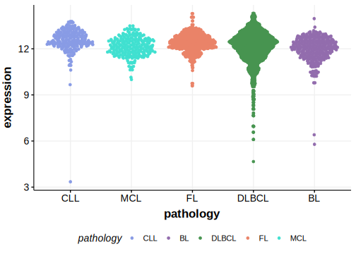

[[_TOC_]]

## Relevance tier by entity

[[include:table1_PAX5.md]]

## Mutation incidence in large patient cohorts (GAMBL reanalysis)

|Entity|source        |frequency (%)|
|:------:|:--------------:|:-------------:|
|DLBCL |GAMBL genomes |3.63         |
|DLBCL |Schmitz cohort|3.19         |
|DLBCL |Reddy cohort  |1.90         |
|DLBCL |Chapuy cohort |3.42         |

## Mutation pattern and selective pressure estimates

[[include:tables/dnds_PAX5.md]]

## aSHM regions

|chr_name|hg19_start|hg19_end|region                                                                                                 |regulatory_comment|
|:--------:|:----------:|:--------:|:-------------------------------------------------------------------------------------------------------:|:------------------:|
|chr9    |37023396  |37027663|[intron-1](https://genome.ucsc.edu/s/rdmorin/GAMBL%20hg19?position=chr9%3A37023396%2D37027663)         |intron            |
|chr9    |37029849  |37037154|[TSS-1](https://genome.ucsc.edu/s/rdmorin/GAMBL%20hg19?position=chr9%3A37029849%2D37037154)            |active_promoter   |
|chr9    |37369209  |37372160|[distal-enhancer-1](https://genome.ucsc.edu/s/rdmorin/GAMBL%20hg19?position=chr9%3A37369209%2D37372160)|enhancer          |
|chr9    |37382267  |37385854|[distal-enhancer-2](https://genome.ucsc.edu/s/rdmorin/GAMBL%20hg19?position=chr9%3A37382267%2D37385854)|enhancer          |
|chr9    |37395932  |37409239|[distal-enhancer-3](https://genome.ucsc.edu/s/rdmorin/GAMBL%20hg19?position=chr9%3A37395932%2D37409239)|enhancer          |

[[include:browser_PAX5.md]]

## Expression

<!-- ORIGIN: pasqualucciHypermutationMultipleProtooncogenes2001a -->
<!-- DLBCL: pasqualucciHypermutationMultipleProtooncogenes2001a -->

[[include:mermaid_PAX5.md]]

## References

