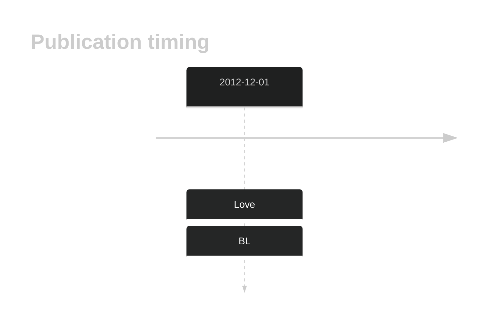

# PC

Due to [minimal support](PC#representative-mutations) in the original primary data, [low expression in BL](PC#pc-expression) and very few mutations reported in subsequent studies, this gene is very unlikely to be relevant in BL. 

## History

## Relevance tier by entity

|Entity|Tier|Description                           |
|:------:|:----:|--------------------------------------|
|    |2-F   |Failed QC|

## Mutation incidence in large patient cohorts (GAMBL reanalysis)

|Entity|source               |frequency (%)|
|:------:|:---------------------:|:-------------:|
|BL    |GAMBL genomes+capture|2.54         |
|BL    |Thomas cohort        |  NA         |
|BL    |Panea cohort         |  NA         |

## Mutation pattern and selective pressure estimates

|Entity|aSHM|Significant selection|dN/dS (missense)|dN/dS (nonsense)|
|:------:|:----:|:---------------------:|:----------------:|:----------------:|
|BL    |No  |No                   |2.187           | 0.000          |
|DLBCL |No  |No                   |0.000           |10.914          |
|FL    |No  |No                   |0.000           |27.654          |

View coding variants in ProteinPaint [hg19](https://morinlab.github.io/LLMPP/GAMBL/PC_protein.html)  or [hg38](https://morinlab.github.io/LLMPP/GAMBL/PC_protein_hg38.html)

View all variants in GenomePaint [hg19](https://morinlab.github.io/LLMPP/GAMBL/PC.html)  or [hg38](https://morinlab.github.io/LLMPP/GAMBL/PC_hg38.html)

## PC Expression

<!-- ORIGIN: loveGeneticLandscapeMutations2012 -->
<!-- BL: loveGeneticLandscapeMutations2012 -->

## Representative Mutations

**Rating**
&starf; &star; &star; &star; &star;

**Rating**
&starf; &star; &star; &star; &star;

## All Mutations

[1059](https://www.bcgsc.ca/downloads/morinlab/GAMBL/Love/1059_reports.html)
[1060](https://www.bcgsc.ca/downloads/morinlab/GAMBL/Love/1060_reports.html)
[321](https://www.bcgsc.ca/downloads/morinlab/GAMBL/Love/321_reports.html)
[512](https://www.bcgsc.ca/downloads/morinlab/GAMBL/Love/512_reports.html)
[742](https://www.bcgsc.ca/downloads/morinlab/GAMBL/Love/742_reports.html)

## References
1.  Love C, Sun Z, Jima D, Li G, Zhang J, Miles R, Richards KL, Dunphy CH, Choi WWL, Srivastava G, Lugar PL, Rizzieri DA, Lagoo AS, Bernal-Mizrachi L, Mann KP, Flowers CR, Naresh KN, Evens AM, Chadburn A, Gordon LI, Czader MB, Gill JI, Hsi ED, Greenough A, Moffitt AB, McKinney M, Banerjee A, Grubor V, Levy S, Dunson DB, Dave SS. The genetic landscape of mutations in Burkitt lymphoma. Nat Genet. 2012 Dec;44(12):1321–1325. PMCID: PMC3674561
