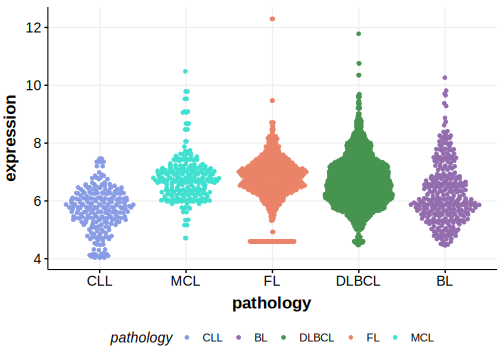
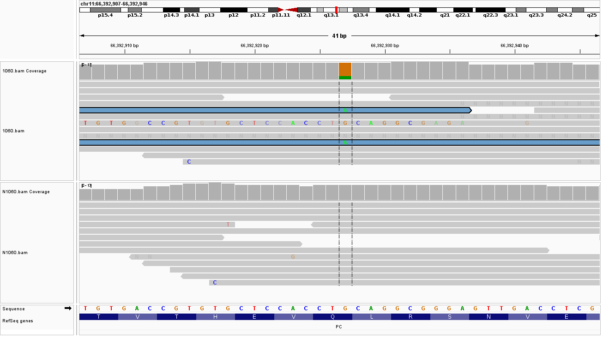
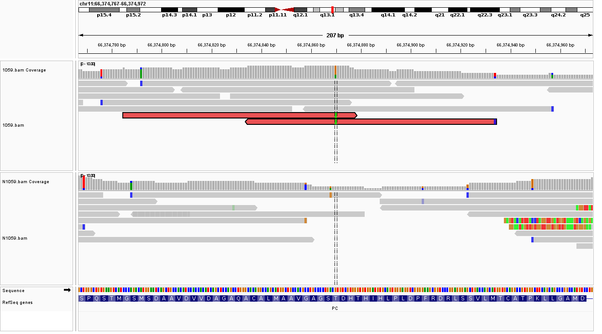

[[_TOC_]]

Due to [minimal support](PC#representative-mutations) in the original primary data, [low expression in BL](PC#pc-expression) and very few mutations reported in subsequent studies, this gene is very unlikely to be relevant in BL. 
<<Warn("The variants reported in this gene in BL failed QC")>>

## Relevance tier by entity

|Entity|Tier|Description                           |
|:------:|:----:|--------------------------------------|
|    |3   |Retired, Failed QC[@loveGeneticLandscapeMutations2012]|

## Mutation incidence in large patient cohorts (GAMBL reanalysis)

|Entity|source               |frequency (%)|
|:------:|:---------------------:|:-------------:|
|BL    |GAMBL genomes+capture|2.54         |
|BL    |Thomas cohort        |  NA         |
|BL    |Panea cohort         |  NA         |

## Mutation pattern and selective pressure estimates

[[include:dnds_PC.md]]

[[include:browser_PC.md]]

## Expression

<!-- ORIGIN: loveGeneticLandscapeMutations2012 -->
<!-- BL: loveGeneticLandscapeMutations2012 -->

## Representative Mutations

**Rating**
&starf; &star; &star; &star; &star;

**Rating**
&starf; &star; &star; &star; &star;

## All Mutations

[1059](https://www.bcgsc.ca/downloads/morinlab/GAMBL/Love/1059_reports.html)
[1060](https://www.bcgsc.ca/downloads/morinlab/GAMBL/Love/1060_reports.html)
[321](https://www.bcgsc.ca/downloads/morinlab/GAMBL/Love/321_reports.html)
[512](https://www.bcgsc.ca/downloads/morinlab/GAMBL/Love/512_reports.html)
[742](https://www.bcgsc.ca/downloads/morinlab/GAMBL/Love/742_reports.html)

[[include:mermaid_PC.md]]

## References

