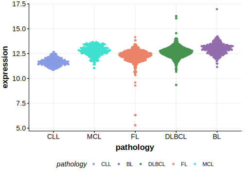

[[_TOC_]]

## Relevance tier by entity

|Entity|Tier|Description               |
|:------:|:----:|--------------------------|
||2|relevance in PMBL/cHL/GZL not firmly established|
|    |1   |high-confidence BL gene[@schmitzBurkittLymphomaPathogenesis2012]   |
| |1   |high-confidence DLBCL gene[@schmitzBurkittLymphomaPathogenesis2012]|

## Mutation incidence in large patient cohorts (GAMBL reanalysis)

[[include:DLBCL_PCBP1.md]]
[[include:BL_PCBP1.md]]

## Mutation pattern and selective pressure estimates

[[include:dnds_PCBP1.md]]

## PCBP1 Hotspots

| Chromosome |Coordinate (hg19) | ref>alt | HGVSp | 
 | :---:| :---: | :--: | :---: |
| chr2 | 70315424 | C>G | Y183* |
| chr2 | 70315425 | C>T | Q184* |
| chr2 | 70315439 | ->AGCT | S190* |
| chr2 | 70315457 | C>A | C194* |

[[include:browser_PCBP1.md]]

## Expression

<!-- ORIGIN: schmitzBurkittLymphomaPathogenesis2012 -->
<!-- BL: schmitzBurkittLymphomaPathogenesis2012 -->

[[include:mermaid_PCBP1.md]]

# References
