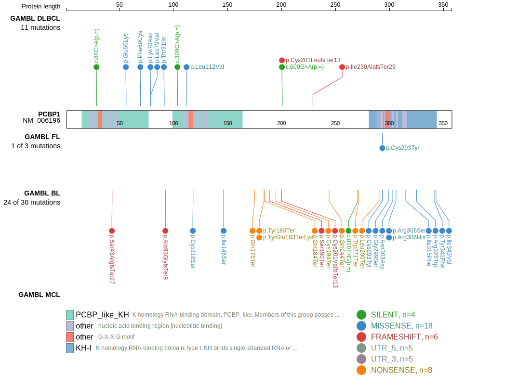
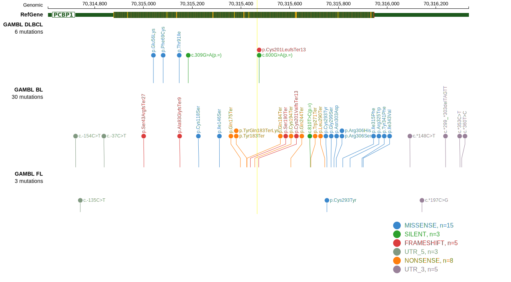

# [PCBP1]

## Mutation tier

|Entity|Tier|Description               |
|:------:|:----:|--------------------------|
|BL    |1   |high-confidence BL gene   |
|DLBCL |1   |high-confidence DLBCL gene|
## Mutation incidence

|Entity|source               |frequency (%)|
|:------:|:---------------------:|:-------------:|
|BL    |GAMBL genomes+capture|12.24        |
|BL    |Thomas cohort        |12.30        |
|BL    |Panea cohort         |11.90        |
|DLBCL |GAMBL genomes        | 1.34        |
|DLBCL |Schmitz cohort       | 2.30        |
|DLBCL |Reddy cohort         | 2.40        |
|DLBCL |Chapuy cohort        | 1.70        |

## Mutation pattern

|Entity|aSHM|Significant selection|dN/dS (missense)|dN/dS (nonsense)|
|:------:|:----:|:---------------------:|:----------------:|:----------------:|
|BL    |No  |Yes                  |16.780          |424.685         |
|DLBCL |No  |No                   | 0.000          |  0.000         |
|FL    |No  |No                   | 1.401          |  0.000         |

> [!NOTE]
> First described in BL in 2015 by [Wagener R](https://pubmed.ncbi.nlm.nih.gov/26173642)

 ## PCBP1 Hotspots

| Chromosome |Coordinate (hg19) | ref>alt | HGVSp | 
 | :---:| :---: | :--: | :---: |
| chr2 | 70315424 | C>G | Y183* |
| chr2 | 70315425 | C>T | Q184* |
| chr2 | 70315439 | ->AGCT | S190* |
| chr2 | 70315457 | C>A | C194* |

View coding variants in ProteinPaint [hg19](https://www.bcgsc.ca/downloads/morinlab/GAMBL/test/genes/PCBP1_protein.html)  or [hg38](https://www.bcgsc.ca/downloads/morinlab/GAMBL/test/genes/PCBP1_protein_hg38.html)

View all variants in GenomePaint [hg19](https://www.bcgsc.ca/downloads/morinlab/GAMBL/test/genes/PCBP1.html)  or [hg38](https://www.bcgsc.ca/downloads/morinlab/GAMBL/test/genes/PCBP1_hg38.html)

