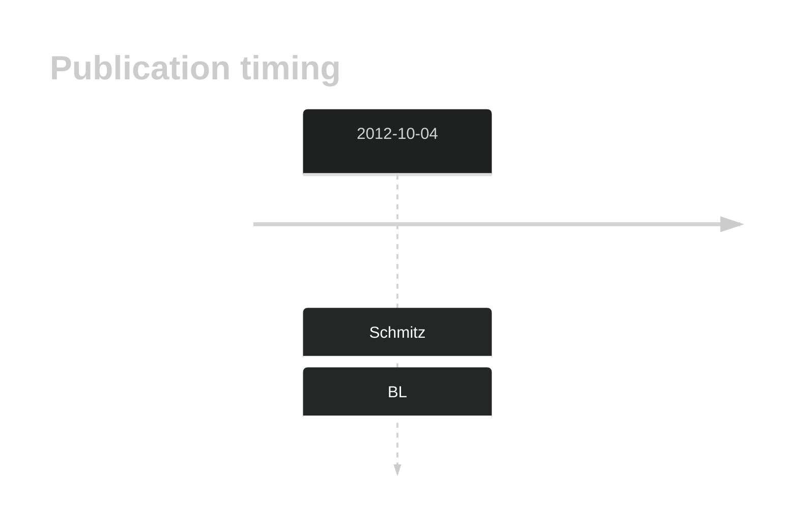

# PCBP1

## History

## Relevance tier by entity

|Entity|Tier|Description               |
|:------:|:----:|--------------------------|
||2|relevance in PMBL/cHL/GZL not firmly established|
|    |1   |high-confidence BL gene[@schmitzBurkittLymphomaPathogenesis2012]   |
| |1   |high-confidence DLBCL gene[@schmitzBurkittLymphomaPathogenesis2012]|

## Mutation incidence in large patient cohorts (GAMBL reanalysis)

[[include:DLBCL_PCBP1.md]]
[[include:BL_PCBP1.md]]

## Mutation pattern and selective pressure estimates

|Entity|aSHM|Significant selection|dN/dS (missense)|dN/dS (nonsense)|
|:------:|:----:|:---------------------:|:----------------:|:----------------:|
|BL    |No  |Yes                  |16.780          |424.685         |
|DLBCL |No  |No                   | 0.000          |  0.000         |
|FL    |No  |No                   | 1.401          |  0.000         |

## PCBP1 Hotspots

| Chromosome |Coordinate (hg19) | ref>alt | HGVSp | 
 | :---:| :---: | :--: | :---: |
| chr2 | 70315424 | C>G | Y183* |
| chr2 | 70315425 | C>T | Q184* |
| chr2 | 70315439 | ->AGCT | S190* |
| chr2 | 70315457 | C>A | C194* |

View coding variants in ProteinPaint [hg19](https://morinlab.github.io/LLMPP/GAMBL/PCBP1_protein.html)  or [hg38](https://morinlab.github.io/LLMPP/GAMBL/PCBP1_protein_hg38.html)

View all variants in GenomePaint [hg19](https://morinlab.github.io/LLMPP/GAMBL/PCBP1.html)  or [hg38](https://morinlab.github.io/LLMPP/GAMBL/PCBP1_hg38.html)

## PCBP1 Expression

<!-- ORIGIN: schmitzBurkittLymphomaPathogenesis2012 -->
<!-- BL: schmitzBurkittLymphomaPathogenesis2012 -->

# References
