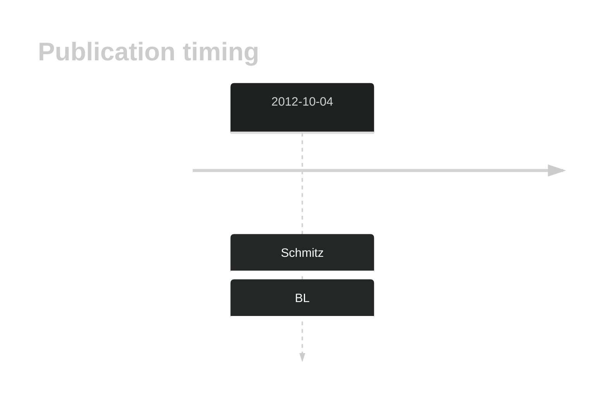

# PCBP1
## History

## Relevance tier by entity

|Entity|Tier|Description               |
|:------:|:----:|--------------------------|
||2|relevance in PMBL/cHL/GZL not firmly established|
|    |1   |high-confidence BL gene   |
| |1   |high-confidence DLBCL gene|

## Mutation incidence in large patient cohorts (GAMBL reanalysis)

|Entity|source               |frequency (%)|
|:------:|:---------------------:|:-------------:|
|BL    |GAMBL genomes+capture|12.24        |
|BL    |Thomas cohort        |12.30        |
|BL    |Panea cohort         |11.90        |
|DLBCL |GAMBL genomes        | 1.34        |
|DLBCL |Schmitz cohort       | 2.34        |
|DLBCL |Reddy cohort         | 2.40        |
|DLBCL |Chapuy cohort        | 1.71        |

## Mutation pattern and selective pressure estimates

|Entity|aSHM|Significant selection|dN/dS (missense)|dN/dS (nonsense)|
|:------:|:----:|:---------------------:|:----------------:|:----------------:|
|BL    |No  |Yes                  |16.780          |424.685         |
|DLBCL |No  |No                   | 0.000          |  0.000         |
|FL    |No  |No                   | 1.401          |  0.000         |

> [!NOTE]
> First described in BL in 2015 by [Wagener R](https://pubmed.ncbi.nlm.nih.gov/26173642)

 ## PCBP1 Hotspots

| Chromosome |Coordinate (hg19) | ref>alt | HGVSp | 
 | :---:| :---: | :--: | :---: |
| chr2 | 70315424 | C>G | Y183* |
| chr2 | 70315425 | C>T | Q184* |
| chr2 | 70315439 | ->AGCT | S190* |
| chr2 | 70315457 | C>A | C194* |

View coding variants in ProteinPaint [hg19](https://morinlab.github.io/LLMPP/GAMBL/PCBP1_protein.html)  or [hg38](https://morinlab.github.io/LLMPP/GAMBL/PCBP1_protein_hg38.html)

View all variants in GenomePaint [hg19](https://morinlab.github.io/LLMPP/GAMBL/PCBP1.html)  or [hg38](https://morinlab.github.io/LLMPP/GAMBL/PCBP1_hg38.html)

## PCBP1 Expression

<!-- ORIGIN: schmitzBurkittLymphomaPathogenesis2012 -->
<!-- BL: schmitzBurkittLymphomaPathogenesis2012 -->
## References
1.  Schmitz R, Young RM, Ceribelli M, Jhavar S, Xiao W, Zhang M, Wright G, Shaffer AL, Hodson DJ, Buras E, Liu X, Powell J, Yang Y, Xu W, Zhao H, Kohlhammer H, Rosenwald A, Kluin P, Müller-Hermelink HK, Ott G, Gascoyne RD, Connors JM, Rimsza LM, Campo E, Jaffe ES, Delabie J, Smeland EB, Ogwang MD, Reynolds SJ, Fisher RI, Braziel RM, Tubbs RR, Cook JR, Weisenburger DD, Chan WC, Pittaluga S, Wilson W, Waldmann TA, Rowe M, Mbulaiteye SM, Rickinson AB, Staudt LM. Burkitt lymphoma pathogenesis and therapeutic targets from structural and functional genomics. Nature. 2012 Oct 4;490(7418):116–120. PMCID: PMC3609867
