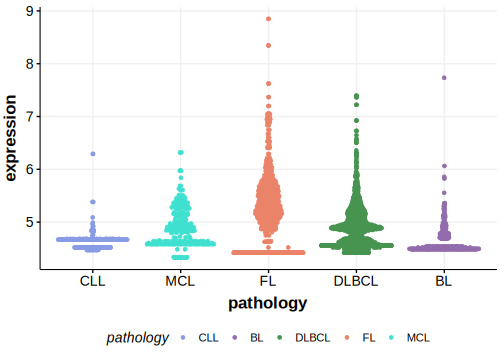

[[_TOC_]]

## Relevance tier by entity

[[include:table1_PCDHA11.md]]

## Warnings

<<Warn("The variants reported in this gene failed QC")>>

**[See below ](#representative-mutations) or [the study page ](papers/paneaWholeGenomeLandscape2019.md#tier-2) for more information**

## Mutation incidence in large patient cohorts (GAMBL reanalysis)

|Entity|source               |frequency (%)|
|:------:|:---------------------:|:-------------:|
|BL    |GAMBL genomes+capture|1.39         |
|BL    |Thomas cohort        |1.30         |
|BL    |Panea cohort         |3.00         |

## Mutation pattern and selective pressure estimates

[[include:dnds_PCDHA11.md]]

[[include:browser_PCDHA11.md]]

## Expression

<!-- ORIGIN: paneaWholeGenomeLandscape2019 -->
<!-- BL: paneaWholeGenomeLandscape2019 -->

## Representative Mutations

**Rating**
&starf; &star; &star; &star; &star; 

[[include:mermaid_PCDHA11.md]]

## References
