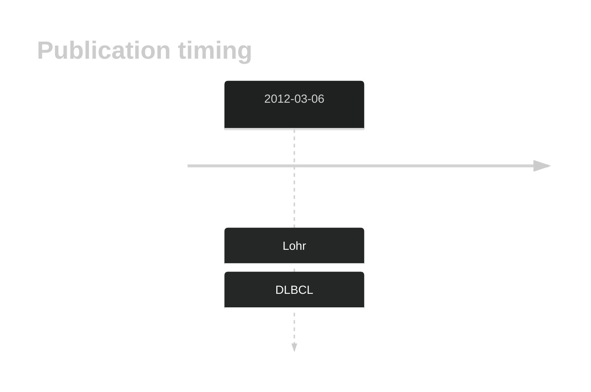

# PCDHB6

## History

## Relevance tier by entity

|Entity|Tier|Description|
|:------:|:----:|--------------------------------------|
||2|relevance in DLBCL not firmly established[@lohrDiscoveryPrioritizationSomatic2012a]|

## Mutation incidence in large patient cohorts (GAMBL reanalysis)

|Entity|source |frequency (%)|
|:------:|:----:|:----:|
|BL|GAMBL Exome |3.448 |
|BL|GAMBL Genome |1.158 |
|DLBCL|GAMBL Exome |1.294 |
|DLBCL|GAMBL Genome |0.752 |
|FL|GAMBL Exome |0.573 |
|MCL|GAMBL Genome |0.585 |

## References

